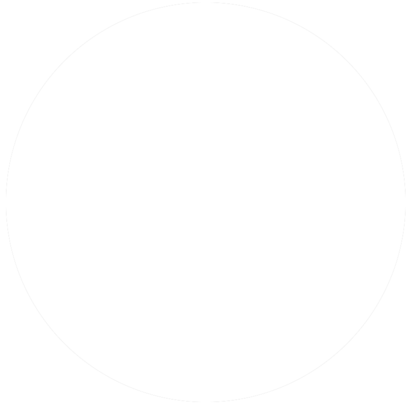

<!-- style: background-image: url(./bg.jpg); color: white; -->

## CSS Houdini 初探

CSSConf CN

@勾三股四 2018-03-31

----

<!-- style: background-image: url(./avatar.png) -->

&nbsp;

&nbsp;
<p>
  
  
  <span style="text-shadow: none; margin-left: 0.5vw; color: #eee; display: inline-block; vertical-align: middle;">/</span>
   <span style="font-size: 10vh; display: inline-block; vertical-align: bottom;">⚽️</span>
</p>

----

<!-- style: background-image: url(./html5-contribution.png) -->

W3C HTML5 Contributor

----

<h1><ruby>
  胡 <rp>(</rp><rt>Hu<sup>2</sup></rt><rp>)</rp>
  迪 <rp>(</rp><rt>di<sup>2</sup></rt><rp>)</rp>
  尼 <rp>(</rp><rt>ni<sup>2</sup></rt><rp>)</rp>
</ruby>?</h1>

----

> Harry Houdini (born Erik Weisz, later Ehrich Weiss or Harry Weiss; March 24, 1874 – October 31, 1926) was an Austro-Hungarian-born American illusionist and stunt performer, noted for his sensational escape acts.

<small>https://en.wikipedia.org/wiki/Harry_Houdini</small>

----

> 哈里·胡迪尼（Harry Houdini，1874年3月24日-1926年10月31日），原名埃里克·韦斯（Ehrich Weiss），匈牙利裔美国魔术师，享誉国际的脱逃艺术家，能不可思议的自绳索、脚镣及手铐中脱困，他同时也是以魔术方法戳穿所谓“通灵术”的反伪科学先驱。

<small>https://baike.baidu.com/item/哈里·胡迪尼/7543901</small>

----

`CSS Houdini`

# CSS 胡迪尼

----

You can extend every part<br>of the browser rendering process:<br>parse, layout, paint, animation ...

----

### CSS Houdini

<div style="display: flex; margin-top: -5vh">
  <ul>
    <li><a href="https://wicg.github.io/CSS-Parser-API/">Parser API</a></li>
    <li><a href="https://drafts.css-houdini.org/css-paint-api/">Paint API</a></li>
    <li><a href="https://drafts.css-houdini.org/css-layout-api/">Layout API</a></li>
    <li><a href="https://wicg.github.io/animation-worklet/">Animation Worklet</a></li>
  </ul>
  <ul>
    <li><a href="https://drafts.css-houdini.org/css-typed-om/">Typed OM</a></li>
    <li><a href="https://drafts.css-houdini.org/css-properties-values-api/">Properties/Values</a></li>
    <li><a href="https://drafts.css-houdini.org/worklets/">Worklets</a></li>
  </ul>
</div>

<small>Font Metrics, Animation API, ScrollTimeline ...</small>

----

1. Basic strong-type APIs
2. Extension APIs for<br/>every part of rendering
3. some other relative specs

----

### 1 Typed OM

* Typed Object Model<br/>for each kind of CSS values
* `StylePropertyMap` for elements

----

```javascript
// <position> 5px 10px
let pos = new CSSPositionValue(
  new CSSUnitValue(5, "px"),
  new CSSUnitValue(10, "px")
);
```

----

```javascript
el.style.width
el.attributeStyleMap.get('width')

getComputedStyle(el).width
el.computedStyleMap().get('width')
```

----

Make all CSS values structured

Easy for complex computation

<small>https://drafts.css-houdini.org/css-typed-om/</small>

----

### 2 Properties/Values

* register new properties
* with name, type, initial value ...

----

```javascript
CSS.registerProperty({
  name: '--stop-color',
  syntax: '<color>',
  inherits: false,
  initialValue: 'rgba(0,0,0,0)'
})
```

----

```javascript
CSS.unregisterProperty(
  '--stop-color'
)
```

----

But why we need this?

----

Let's see CSS Vars first.

<small>https://drafts.csswg.org/css-variables/</small>

----

```css
.button {
  --stop-color: red; /* red */
  background: linear-gradient(
    var(--stop-color), black);
  transition: --stop-color 1s;
}
.button:hover {
  --stop-color: green; /* green */
}
```

----

<h1><ruby>
  划重点 <rp>(</rp><rt>The Point</rt><rp>)</rp>
</ruby></h1>

----

```
.button { transition: --stop-color 1s; }
```

----

CSS Vars do NOT

support transitions well

----

> The allowed syntax for custom properties is **extremely permissive**. The <declaration-value> production matches any sequence of one or more tokens ...

<small>https://drafts.csswg.org/css-variables/</small>

----

> Notably, they can even be transitioned or animated, but since the UA has no way to interpret their contents, they always use the **"flips at 50%"** behavior that is used for any other pair of values that can’t be intelligently interpolated.

<small>https://drafts.csswg.org/css-variables/</small>

----

But now we have `CSS.registerProperty()`

So it works now.

<small>https://drafts.css-houdini.org/css-properties-values-api/</small>

----

# Demo

[link](https://codepen.io/Jinjiang/pen/OvZqNr)

----

### 3 Worklets

* app -> applet 小应用
* worker -> worklet 小进程

----

> ... running scripts in stages of the rendering pipeline independent of the main javascript execution environment.

<small>https://drafts.css-houdini.org/worklets/</small>

----

`xxxWorklet.addModule('xxx.js').then(...)`

will be used in all below

----

### 4 Paint API

Define new CSS syntax to draw an image in a certain area with Canvas API (subset).

----

```css
button {
  background-image: url(...);
  background-image: paint(xxx);
}
```

----

```javascript
CSS.paintWorklet.addModule('xxx.js')
```

----

```javascript
// xxx.js
registerPaint('xxx', class {
  static get inputProperties () { ... }
  static get inputArguments () { ... }
  paint (ctx, geom, props) { ... }
})
```

----

* watch area size and<br/>some properties
* allowed some arguments
* have a Canvas context

----

> Note: The `PaintRenderingContext2D` implements a subset of the `CanvasRenderingContext2D` API. Specifically it doesn’t implement the `CanvasImageData`, `CanvasUserInterface`, `CanvasText`, or `CanvasTextDrawingStyles` APIs.

<small>https://drafts.css-houdini.org/css-paint-api/#2d-rendering-context</small>

----

# Demo

[link](https://codepen.io/Jinjiang/pen/QmrovW)

----

### Other Online Resources

- [Samples - GoogleChromeLabs](https://googlechromelabs.github.io/houdini-samples/)
- [Experimental showcase](https://lab.iamvdo.me/houdini/) by [@iamvdo](https://twitter.com/iamvdo)

----

### 5 Layout API

To write polyfills for any layout algorithm.

----

Not implemented and no demo here.

But just imagine that:

----

<!-- style: background-image: url(./waterfall.png) -->

```css
taobao-item-list {
  display: layout(waterfall);
}
```

<small>https://myst729.github.io/Waterfall/</small>

----

<!-- style: background-image: url(./tagcloud.png) -->

```css
keyword-list {
  display: layout(tag-cloud)
}
```

<small>https://www.jasondavies.com/wordcloud/</small>

----

```javascript
CSS.layoutWorklet.addModule('waterfall.js')
```

----

```javascript
// waterfall.js
registerLayout('waterfall', class {
  static get inputProperties ()
  static get childrenInputProperties ()
  static get childDisplay ()
  *intrinsicSizes(children, styleMap)
  *layout(constraints, children,
    styleMap, edges, breakToken)
})
```

----

It's more complex. But very powerful.

<small>https://drafts.css-houdini.org/css-layout-api/</small>

----

And 2 other specs:

* [Box Tree API](https://drafts.css-houdini.org/box-tree-api/)
* [Font Metrics API](https://drafts.css-houdini.org/font-metrics-api/)

<small>They can help you do more precise work.</small>

----

### 6 Animation Worklet

Connect different animations together with some fixed rules.

----

# Demo

[link](https://googlechromelabs.github.io/houdini-samples/animation-worklet/twitter-hidey-bar/)

<small>actually it's a polyfill</small>

----

What's the magic here?

----

You need to learn first:

- [Web Animations](https://drafts.csswg.org/web-animations/)
- [Timeline](https://drafts.csswg.org/web-animations/#timelines)
- [Keyframe Effects](https://drafts.csswg.org/web-animations/#keyframe-effects)
- [Scroll-Linked Animation](https://wicg.github.io/scroll-animations/)

----

Then use [Animation Worklet](https://wicg.github.io/animation-worklet/) to connect them together!

----

```javascript
animationWorklet.addModule('sticky.js')
.then(() => {
  new WorkletAnimation(
    'sticky',
    effect,
    scrollTimeline,
    { scrollTimeline, docTimeline }
  ).play()
})
```

----

```javascript
// sticky.js
registerAnimator('sticky', class {
  constructor (options)
  animate (currentTime, effect)
})
```

----

Implemented but not really work well in Chrome.

<small>https://wicg.github.io/animation-worklet/</small>

----

### 7 Parser API

parsing arbitrary CSS-like languages into a mildly typed representation

----

Not implemented and no demo.

<small>https://wicg.github.io/CSS-Parser-API/</small>

----

<!-- style: background-image: url(./houdini-support.png); background-size: contain; -->

https://ishoudinireadyyet.com

----

# Conclusion

----

### CSS Houdini

<div style="display: flex; margin-top: -5vh;">
  <ul>
    <li><a href="https://wicg.github.io/CSS-Parser-API/">Parser API</a></li>
    <li><a href="https://drafts.css-houdini.org/css-paint-api/">Paint API</a></li>
    <li><a href="https://drafts.css-houdini.org/css-layout-api/">Layout API</a></li>
    <li><a href="https://wicg.github.io/animation-worklet/">Animation Worklet</a></li>
  </ul>
  <ul>
    <li><a href="https://drafts.css-houdini.org/css-typed-om/">Typed OM</a></li>
    <li><a href="https://drafts.css-houdini.org/css-properties-values-api/">Properties/Values</a></li>
    <li><a href="https://drafts.css-houdini.org/worklets/">Worklets</a></li>
  </ul>
</div>

<small>Font Metrics, Animation API, ScrollTimeline ...</small>

----

### References

- Specs in [Houdini Team](https://drafts.css-houdini.org/) and [WICG](https://wicg.io)
- Slides from [@malyw](http://slides.com/malyw/houdini) [@philwalton](https://philipwalton.github.io/talks/2017-06-15/)<br />and [Google I/O](https://www.youtube.com/watch?v=sE3ttkP15f8)
- Samples from [Chrome](http://googlechromelabs.github.io/houdini-samples/) [@iamvdo](https://lab.iamvdo.me/houdini/)

----

### Articles

- [Say Hello to Houdini<br>and the CSS Paint API](https://codersblock.com/blog/say-hello-to-houdini-and-the-css-paint-api/)
- [CSS Tricks](https://css-tricks.com/what-houdini-means-for-animating-transforms/)
- [Google Developers](https://developers.google.com/web/updates/2016/05/houdini)
- [Smashing Magazine](https://www.smashingmagazine.com/2016/03/houdini-maybe-the-most-exciting-development-in-css-youve-never-heard-of/)

----

<!-- style: background-image: url(./manifesto.png) -->

## [The Extensible Web Manifesto](https://www.w3.org/community/nextweb/)

----

### Now We Have

* Web Components
* Web Assembly
* CSS Houdini

----

### Let's <s>do</s> try it!

----

<h1><ruby>
  玩 <rp>(</rp><rt>One🤪</rt><rp>)</rp>
  毛 <rp>(</rp><rt>More😎</rt><rp>)</rp>
  线 <rp>(</rp><rt>Thing</rt><rp>)</rp>
</ruby></h1>

----

```
my-slides {
  // created with AI
  // via 阿里巴巴达摩研究院
  font-family: 阿里汉仪智能黑体;
}
```

----

# Thanks

<small>@勾三股四 zhaojinjiang@me.com</small>
