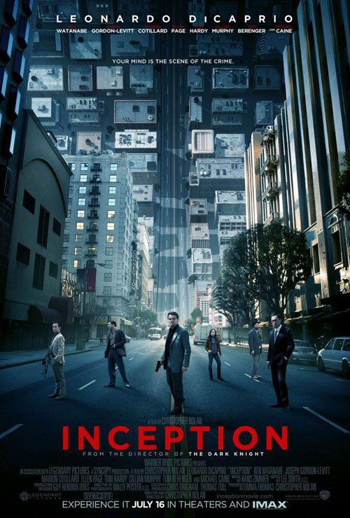
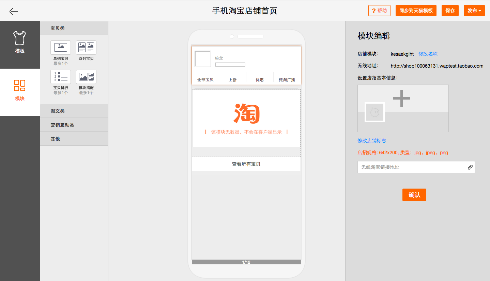

# {CSS}

----

## About

----

## 个人简介

* 赵锦江
* [W3C HTML 中文兴趣组](http://www.w3.org/html/ig/zh/)
* 无线事业部 阿里巴巴 杭州
* [@勾三股四](http://weibo.com/mx006)
* [jiongks.name](http://jiongks.name)

----

# agenda

* webcomponents
* css scoping
* our practice

----

# webcomponents

----

这是什么？

----

## webcomponents

* 组件化开发
* 自定义标签
* 隐藏内部结构

----

## 组件化开发

----

## 自定义标签

> `<google-map></google-map>`

----

## 隐藏内部结构

----

## Shadow DOM

> `<custom-element>`  
> `　<!-- shadow-root -->`  
> `　　`  
> `　　<!-- 内部结构 -->`  
> `　<!-- /shadow-root -->`  
> `</custom-element>`

----

## Shadow DOM

* 为元素建立 `shadow root`，内部样式与外部样式表相隔离
* 没有外界干扰，没有额外的代码，像原生标签一样

----

## 典型的组件定义

> `<new-tag>`  
> `　生命周期、交互行为、自定义事件`  
> `　<!-- shadow -->`  
> `　　内部结构、内部样式`  
> `　<!-- /shadow -->`  
> `　子元素`  
> `</new-tag>`

----

## 回头想想HTML5

* `<header>`, `<footer>`, ...  
* `<audio>`, `<video>`  
* `
`, `
`
* 都可以这样创建

----

我们不再需要规范新的标签了

----

## 想象一下……

> `<calendar date="2015-01-10"></calendar>`  
> `<pagination value="3/10"></pagination>`  
> `<login-box></login-box>`

----

## 想象一下……

> `<iphone>...</iphone>`  
> `<weibo>...</weibo>`  
> `<slider>...</slider>`

----

## 实例

----

庖丁解牛

美好前端的未来!

----

## 更多资料

* [W3C Spec](http://w3c-html-ig-zh.github.io/webcomponents/)
* [webcomponents.org](http://webcomponents.org/)
* [Polymer](http://docs.polymerchina.org/)
* [Screencast](http://www.tudou.com/plcover/r0pA0z77CgM/)

----

# 新的 CSS 用法

----

## 样式表结构

* 元素可能包含 shadow
* 元素可能在另一个 shadow 内
* 元素可能包含子元素
* 子元素可能受 shadow 影响

----

----

----

## 建立联系

* 外部结构
* 内部结构
* 子元素

----

## 举个例子

`<cssconf-speaker>`  
[homepage](http://css.w3ctech.com/)

----

## `<cssconf-speaker>`

----

判断外部环境

----

## :host

> `:host {display: block}`

[code](view-source:http://jinjiang.github.io/webcomponents-demo/css-scoping/speaker.html) [demo](http://jinjiang.github.io/webcomponents-demo/css-scoping/speaker.html)

----

## :host(<selector>)

> `:host(:hover) {...}`

[code](view-source:http://jinjiang.github.io/webcomponents-demo/css-scoping/speaker-1.html) [demo](http://jinjiang.github.io/webcomponents-demo/css-scoping/speaker-1.html)

----

## :host(<selector>)

> `:host([gender="female"]) {...}`

[code](view-source:http://jinjiang.github.io/webcomponents-demo/css-scoping/speaker-2.html) [demo](http://jinjiang.github.io/webcomponents-demo/css-scoping/speaker-2.html)

----

## :host-context(<selector>)

> `:host-context(fieldset[disabled]) btn {...}`

----

## :host-context(<selector>)

> `:host-context(body[env="phone"]) {...}`

[code](view-source:http://jinjiang.github.io/webcomponents-demo/css-scoping/speaker-3.html) [demo](http://jinjiang.github.io/webcomponents-demo/css-scoping/speaker-3.html)

----

## 判断外部环境

* `:host`
* `:host(<selector>)`
* `:host-context(<selector>)`

----

判断内部结构

----

## ::shadow

> `cssconf-speaker::shadow .inner {...}`

[code](view-source:http://jinjiang.github.io/webcomponents-demo/css-scoping/speaker-4.html) [demo](http://jinjiang.github.io/webcomponents-demo/css-scoping/speaker-4.html)

----

## ::shadow

> `photo::shadow .inner {...}`

[code](view-source:http://jinjiang.github.io/webcomponents-demo/css-scoping/speaker-5.html) [demo](http://jinjiang.github.io/webcomponents-demo/css-scoping/speaker-5.html)

----

## /deep/

> `html /deep/ [layout][vertical] {...}`

[code](view-source:http://jinjiang.github.io/webcomponents-demo/css-scoping/speaker-6.html) [demo](http://jinjiang.github.io/webcomponents-demo/css-scoping/speaker-6.html)

----

## 判断内部结构

* `::shadow`
* `/deep/`

----

内部判断子元素

----

## ::content

> `::content .avatar {...}`

[code](view-source:http://jinjiang.github.io/webcomponents-demo/css-scoping/speaker-7.html) [demo](http://jinjiang.github.io/webcomponents-demo/css-scoping/speaker-7.html)

----

## 总结

* `:host`, `:host(<selector>)`
* `:host-context(<selector>)`
* `::shadow`, `/deep/`
* `::content`

----

## 更多资料

* [W3C CSS Scoping Spec](http://www.w3.org/TR/css-scoping-1/#shadow-dom)

----

# 淘宝的实践

----

* 后台管理界面
  * 交互复杂
  * 逻辑性较强
  * 兼容性要求较低
* 基于 [Polymer](http://docs.polymerchina.org/)

----

替代之前大量使用的 Bootstrap

----

## 组件化的优势

* 代码量更小
* 对交互和数据友好
* 易于分工和维护

----

## 卖家装修后台

----

## Zorro.html

----

## Zorro.html

内部管理界面的组件库  
*未来有开源计划*

----

## Thanks & QA

赵锦江 @勾三股四  
zhaojinjiang@me.com
