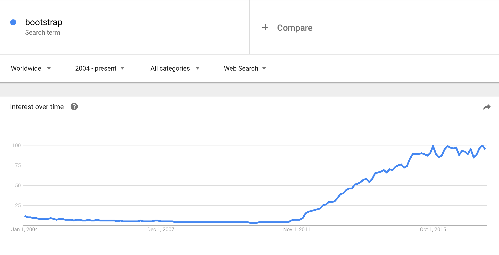
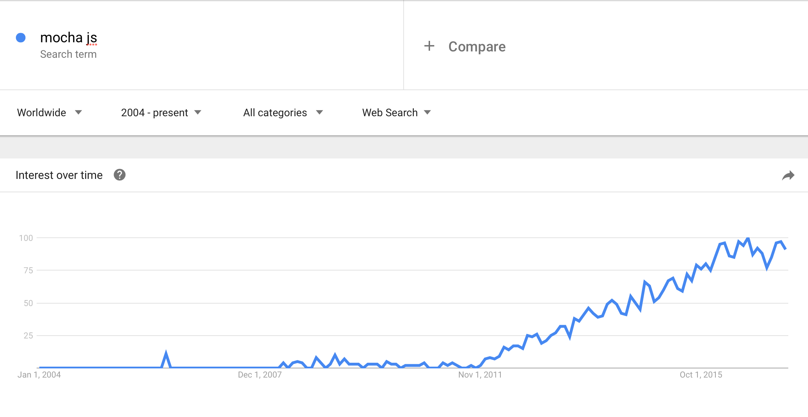
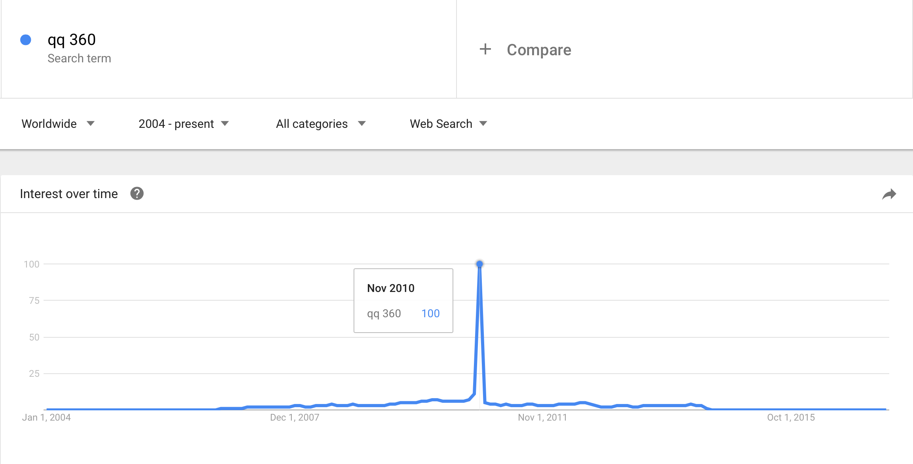
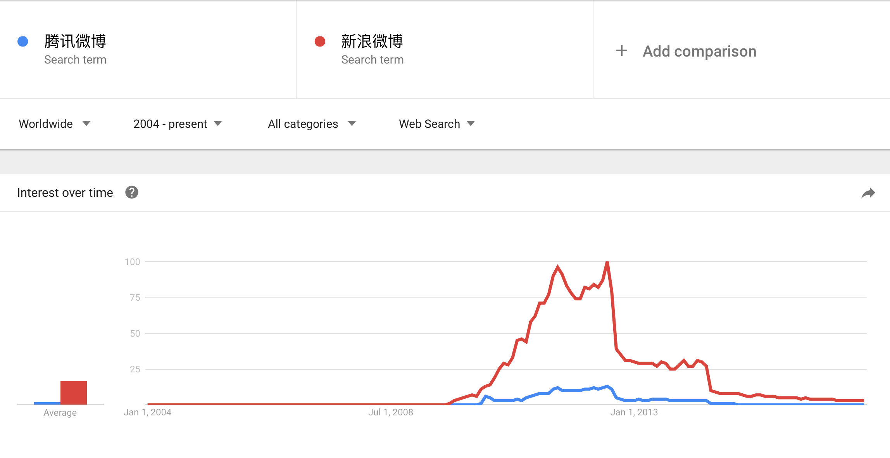
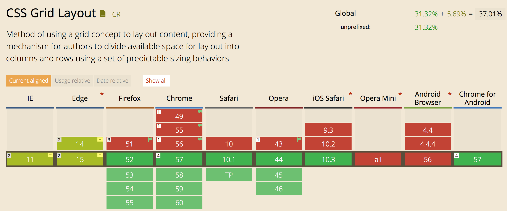

# CSS Grid Layout

----

# 历史 需求 因果

----

### 看几个例子

* [horizon](http://horizon.io)
* [wsj](https://www.wsj.com/articles/live-streaming-music-to-fans-on-smartphones-is-a-pretty-good-gig-1490443203)
* [awwwards](https://www.awwwards.com)

----

### Web 布局

* table
* float
* position
* flexbox
* ……

----

# grid

----

# <ruby>网<rt>wăng</rt></ruby><ruby>格<rt>gé</rt></ruby><ruby>布<rt>bù</rt></ruby><ruby>局<rt>jú</rt></ruby>

----

网格布局的需求和概念一直存在

* [960 grid system](https://960.gs)
* [bootstrap](http://getbootstrap.com)
* [css grid layout](https://www.w3.org/TR/css3-grid-layout/)

----

# 网格布局的要素

----

### 描述步骤

1. 画网
2. 把格子填到网里
3. 把内容填到格子里

----

### 1. 画网

* 几行几列？
* 每行多宽？每列多高？
* 延展性：“漏网之鱼”

----

### 特殊情况：响应式布局

* 每列 (最小) 宽度固定
* 响应式计算总列数
* 自增必要的行

----

## 2. 把格子填进网里

----

### A 每个格子独立

* 放第几行？第几列？
* 占多少行？多少列？

----

### B 按顺序填进网里

* 这个格子排在第几？

<small>额外的：网的排法  
(横向优先/纵向优先)</small>

----

### 3. 对齐

* 行列真空 -> 行列对齐
* 内容真空 -> 内容对齐

<small>额外的：网的行间列间空隙</small>

----

# CSS Grid Layout

start from [W3C Working Draft 7 April 2011](http://www.w3.org/TR/2011/WD-css3-grid-layout-20110407)

----

## What Happened in 2011?

----



----



----



----



----


----

# 规范介绍

----

## 术语

----

### 网格

* template
* row / column
* cell

----

### 辅助

* line / track

----

### 内容

* area

----

## 图解 Grid 语法

[Cheetsheet](./grid-cheatsheet.pdf)

----

### 最低消费

* 画网 + 填格子
* 自动排序
* 响应式
* 对齐和间隙

----

### Demos

* [`grid-auto-columns` & `grid-auto-rows`](https://codepen.io/anon/pen/RVWoyB)
* [`repeat(auto-fit, minmax(size, 1fr))`](https://codepen.io/anon/pen/XRmNPp)
* [`grid-auto-flow: row dense`](http://codepen.io/simonswiss/pen/PNeJmy)

----

### 效率和体验问题

* 语义化描述：[线](https://codepen.io/anon/pen/RVWgbE)/[区域](https://codepen.io/anon/pen/BRoZoB)
* [span 语法](https://www.w3.org/TR/css3-grid-layout/#example-198bb78c)
* [语法简写](https://codepen.io/anon/pen/gWaxzx)

----

### 浏览器支持情况



----

### 周边及其他

* 结合 media query
* [postcss-grid-kiss](https://github.com/sylvainpolletvillard/postcss-grid-kiss)
* 对 CSS 语法词法的思考

----

### 相关材料

* [GridByExample.com](http://gridbyexample.com/examples/)
* [CSS Tricks](https://css-tricks.com/snippets/css/complete-guide-grid/)
* [MDN](https://developer.mozilla.org/en-US/docs/Web/CSS/CSS_Grid_Layout)

----

# Thanks

<!--

### misc

----

## props

* `display`: `grid` | `inline-grid` | `subgrid`

----

* `grid`: `none` | `<grid-template-rows>` / `<grid-template-columns>` | `<grid-auto-flow>` [`<grid-auto-rows>` [/ `<grid-auto-columns>`]]

* `grid-template`: `none` | `subgrid` | `<grid-template-rows>` / `<grid-template-columns>`
* `grid-template-rows`: `<track-size>` ... | [`<line-name>`] `<track-size>` ...
* `grid-template-columns`
* `grid-template-areas`: "`<grid-area-name>` | `.` | `none` | ..." "..." "..." ...

* `grid-auto-rows`: `<track-size>` ...
* `grid-auto-columns`
* `grid-auto-flow`: `row` | `column` | `row dense` | `column dense`

----

* `grid-gap`: `<grid-row-gap>` `<grid-column-gap>`
* `grid-row-gap`: `<line-size>`
* `grid-column-gap`

----

* `grid-area`: `<name>` | `<row-start>` / `<column-start>` / `<row-end>` / `<column-end>`

* `grid-row`: `<start-line>` / `<end-line>` | `<start-line>` / `span <value>`
* `grid-row-start`: `<number>` | `<name>` | `span <number>` | `span <name>` | `auto`
* `grid-row-end`

* `grid-column`
* `grid-column-start`
* `grid-column-end`

* `order`

----

* `justify-content`: `start` | `end` | `center` | `stretch` | `space-around` | `space-between` | `space-evenly`
* `align-content`
* `justify-items`
* `align-items`
* `justify-self` (row): `stretch` | `start` | `end` | `center`
* `align-self` (column): `stretch` | `start` | `end` | `center`

----

## terms

### elements

* container
* item

### layout

* line
* track
* axis
* cell
* area
* column
* row
* gutter

----

## values

* `track-size`: `<length`> | `<precentage>` | `fr`
* `line-size`: `<length>`
* `fr`
* `repeat(3, 20px [col-start])`
* `minmax()`
* `auto-fill`
* `auto-fit`
* `fit-content()`

----

## span

```
span
  number / auto
  auto / number
    1 / auto
    auto / -3
  number / number
  name / number
  number / name
  name / name
    1 / 2
    A / -2
    2 / C
    B / D
  A / span B
  span B / A
    A
      number: 第 i 个 (或倒数第 -i 个)
      name: 第 1 个名字为 n 的
      name number：第 i 个 (或倒数第 -i 个) 名字为 n 的
    B
      number: 第 i 个 (或倒数第 -i 个)
      name: 第 1 个名字为 n 的
    A / span number
      2 / span -2
      A / span -2
      A 2 / span -2
    A / span name
      2 / span C
      A / span C
      A 2 / span C
    span number / A
      span 2 / -2
      span 2 / C
      span 2 / C -2
    span name / A
      span A / 2
      span A / C
      span A / C -2
```

-->
