## 5 CSS Features

... you don't know

<small>@Jinjiang - CSSConfCN V - 2019-03-30</small>

----

## 5 CSS Features

... you _probably_ don't know 😂

<small>@Jinjiang - CSSConfCN V - 2019-03-30</small>

----

## 5 CSS Features

... you probably already know _today_ 😂😂😂

<small>@Jinjiang - CSSConfCN V - 2019-03-30</small>

----

<!-- style: background-image: url(./photo.jpg); background-position: 0 0; color: white; -->

### Self Introduction

- Jinjiang Zhao
-  core team / 

----

<!-- style: text-shadow: 4px 4px 2px white; background-image: linear-gradient(0, rgba(255,255,255,.8), rgba(255,255,255,.8)), url(./cssconf-1.jpg), url(./cssconf-2-1.png), url(./cssconf-2-2.jpg), url(./cssconf-3.jpg), url(./cssconf-4.jpg); background-size: 100% 100%, 50% 50%, 50% 50%, 50% 50%, 50% 50%, 50% 50%; background-position: 0 0, 5vw 5vh, 15vw 15vh, 25vw 25vh, 35vw 35vh, 45vw 45vh; -->

### My CSS Talks in the Past

- CSS in webcomponents
- CSS memos in Taobao
- CSS in Native
- Exploring CSS Houdini

----

<!-- backgroundImage: ./flexbox.png -->

人生巅峰

----

<!-- backgroundImage: ./flexbox.png -->

人生巅峰 

----

... always focus on new standards

so does today ...

----

1. `********`
1. `********`
1. `********`
1. `********`
1. `********`

----

# 1. Float

----

``` css
<div>
  
  <p>...</p>
</div>
```

----

Think about where `float` came from?

----

<div style="display: flex;">
  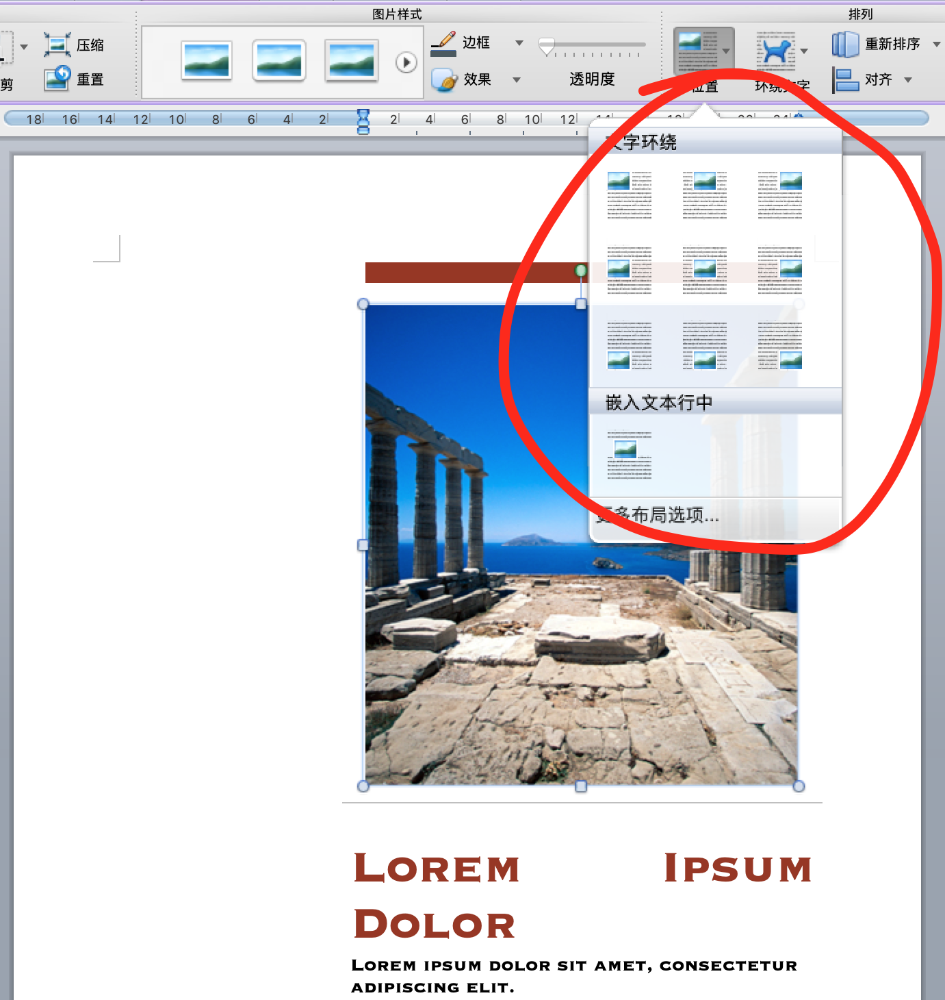
  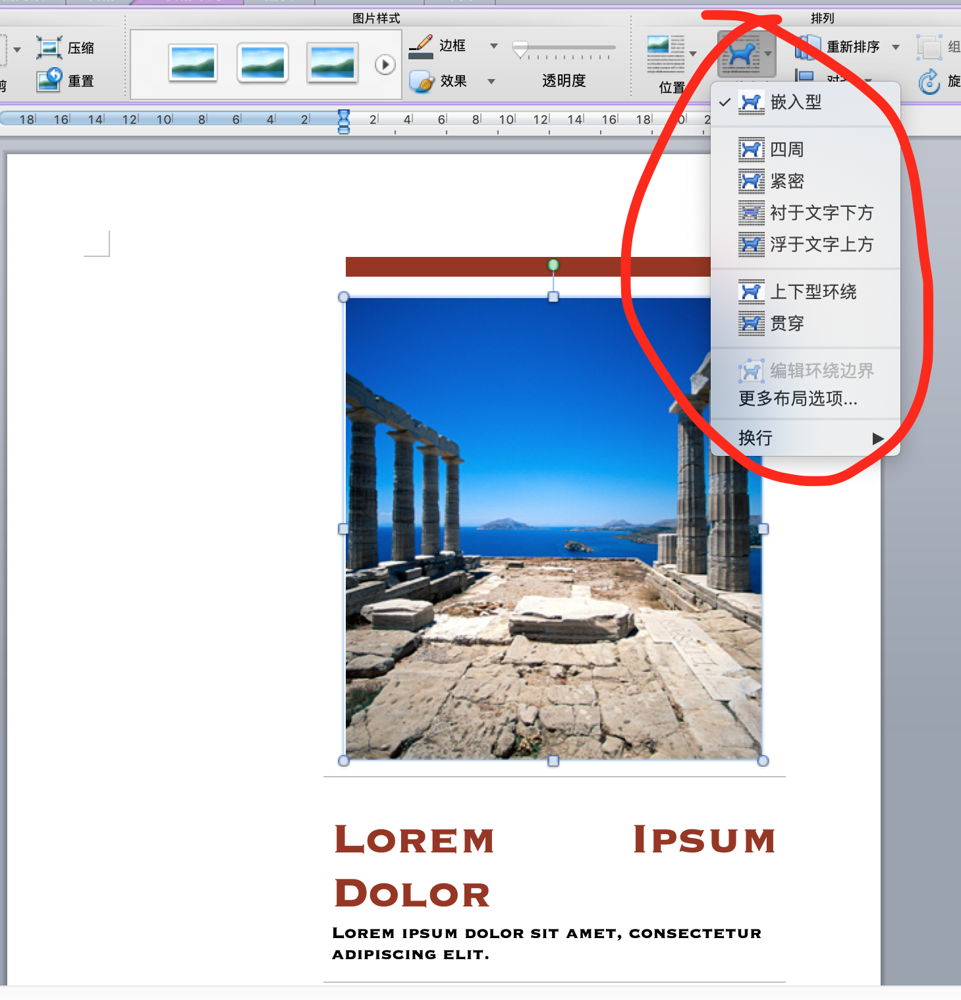
</div>

----

How to make _more_ effects with CSS 🤔?

----

with [CSS Shapes](https://drafts.csswg.org/css-shapes/) (again😅) 

----

# Demo

[demo 1](./float.html) [demo 2](./float-threshold.html)

----

How to make _all_ the effects with CSS 🤔?

----

### More Effects

- [CSS exclusions](https://drafts.csswg.org/css-exclusions/)
- [CSS regions](https://drafts.csswg.org/css-regions/)

----

### CSS Exclusions

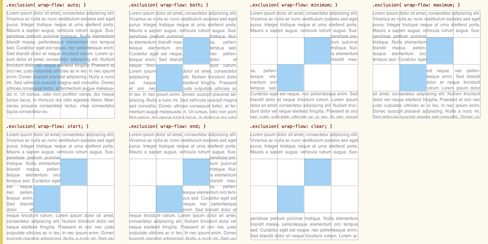

----

### CSS Regions

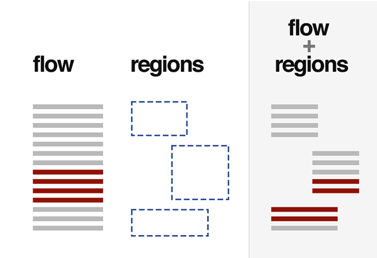

<small>[Magazine-like Layout for the Web](https://www.html5rocks.com/en/tutorials/regions/adobe/) via html5rocks</small>

----

### CSS Regions

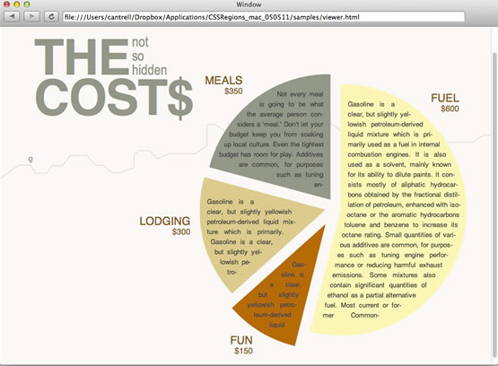

<small>[Magazine-like Layout for the Web](https://www.html5rocks.com/en/tutorials/regions/adobe/) via html5rocks</small>

----

### Some Opinions

- [CSS Regions Considered Harmful](https://alistapart.com/blog/post/css-regions-considered-harmful)
- [The frustrations of using Shapes and Exclusions](https://benfrain.com/the-frustrations-of-using-css-shapes-and-css-exclusions/)
  - [CSS exclusions with Queen Bey](https://www.chenhuijing.com/blog/css-exclusions-with-queen-bey/) 

----

1. float
1. `********`
1. `********`
1. `********`
1. `********`

----

# 2. Page

When you design for print media.

----

### `@media print {}`

- no interactions
- page size vs screen size
- multi-pages vs 1 screen
- "orphans", "widows"

----

### `@media print {}`

- content accessible
- page box
- page break & page float
- "orphans", "widows"

----

### Content Accessible

``` css
@media print {
  a::after {
    content: " - " attr(href);
    font-size: 0.8em;
  }
}
```

----

### Page Box

<div style="display: flex;">
  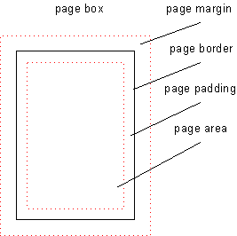
  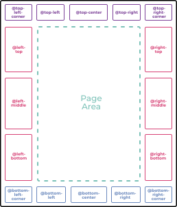
</div>

----

### Page Size

- `@page { size: a4; margin: 0; }`

----

### Page Margin Rules

``` css
@page {
  @top-left { ... }
  @top-center { ... }
  @top-right { ... }
  ...
}
```

----

### w/ Generated Content

``` css
@page {
  @top-left { content: ... }
  @top-center { content: ... }
  @top-right { content: ... }
}
h2 { string-set: ... }
```

----

### w/ Generated Content

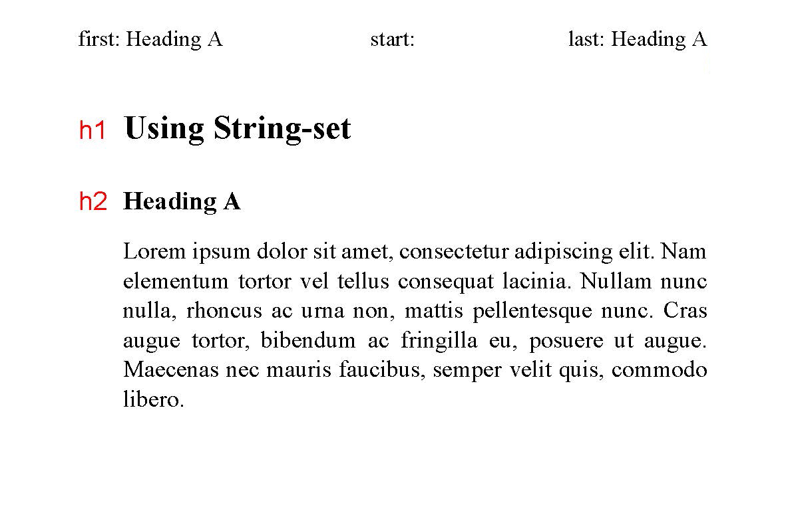

----

### More About Generated Content

- string set, running elements, footnotes
- also: leaders, quotes, counters, bookmarks

<small>Refs: [W3C CSS Generated Content](https://drafts.csswg.org/css-content/) &amp; [W3C CSS Generated Content for Page Media](https://drafts.csswg.org/css-gcpm/)</small>

----

### Page Breaks

- `break-after`, `break-before`
- `break-inside`
- `orphans`, `widows`
- `box-decoration-break` 

<small>Ref: [W3C CSS Fragmentation Module](https://drafts.csswg.org/css-break/) (fragmentation🤔?)</small>

----

### Examples

my current slides

try <kbd>CMD</kbd>+<kbd>P</kbd> to print

----

``` css
@page {
  size: legal landscape;
  margin: 0;
}
```

----

``` css
@media print {
  .slide {
    break-after: page;
    width: 100vw; height: 100vh;
    overflow: hidden; position: relative;
    display: block !important;
    opacity: 1 !important;
  }
}
```

----

Back to fragmentation🤔?

----

### Break for More Media

> In CSS, <mark>in addition to paged media</mark>, certain layout features such as <mark>regions</mark> and <mark>multi-column</mark> layout create a similarly fragmented environment.
> 
> <small>-- W3C CSS Fragmentation Module</small>

----

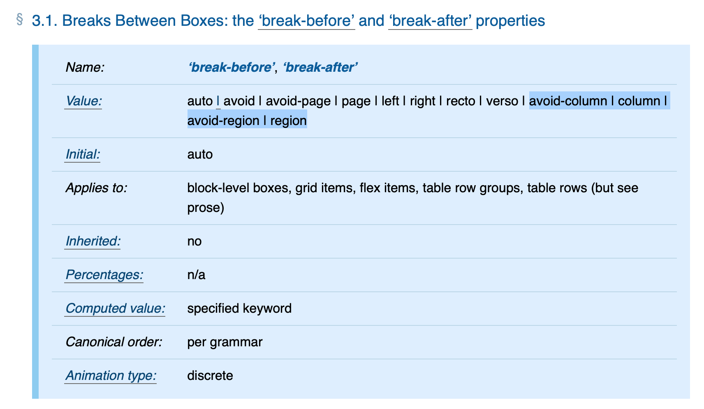

----

### Back to Float

<small>[W3C CSS Page Floats](https://drafts.csswg.org/css-page-floats/)</small>

----

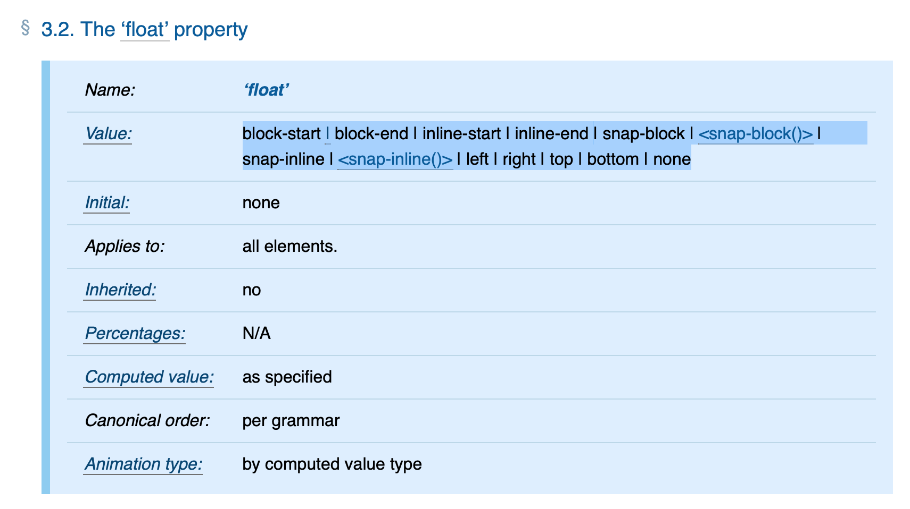

----

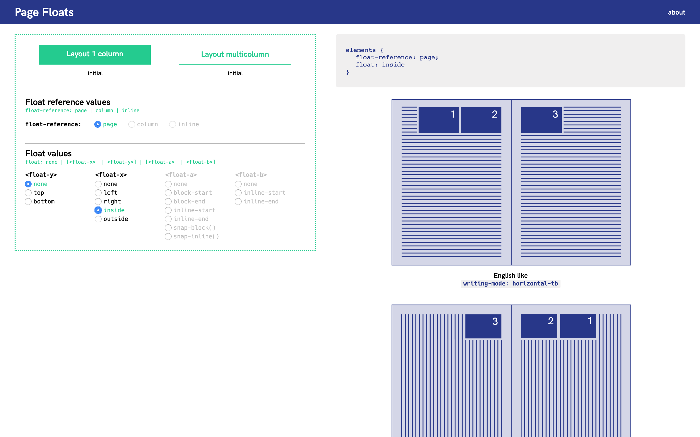

<small>via: http://demos.pagedmedia.org/page-floats/</small>

----

### More About Page Media

https://www.pagedmedia.org

----

1. float
1. page
1. `********`
1. `********`
1. `********`

----

# 3. Scroll

----

for better scroll experience

----

- [custom scrollbar](https://drafts.csswg.org/css-scrollbars/)
- [scroll smoothly](https://drafts.csswg.org/cssom-view/#propdef-scroll-behavior)
- [snap position](https://drafts.csswg.org/css-scroll-snap/) 

----

### Custom Scrollbar

- `scrollbar-color: auto|dark|light`
- `scrollbar-color: ThreeDFace Scrollbar`

background: [IE 5.5](https://msdn.microsoft.com/en-us/library/ff520895(v=vs.85).aspx)

----

### Custom Scrollbar

- `scrollbar-width: auto|thin|none`
- `scrollbar-width: <length>`

----

Why not `::-webkit-scrollbar-*` 🤔? 

----

### [3 Main Use-Cases](https://drafts.csswg.org/css-scrollbars-1/#scope)

- Color scrollbars to fit better
- Thinner scrollbars for small area
- Customize without affecting scrollability

<small>also see: https://www.w3.org/wiki/Css-scrollbars#Why_not_pseudos</small>

----

### Scroll Behavior

- `scroll-behavior: smooth`

<small>working with `el.scroll(x, y)`</small>

----

 > Sudden changes don’t exist in the real world!

 <small>-- Glen Keane, Disney legend</small>

----

### Scroll Snap

[demo](./scroll.html)

----

### One More

- event model for snap scroll <small>[under discussion](https://github.com/w3c/csswg-drafts/issues/156)</small>

----

1. float
1. page
1. scroll
1. `********`
1. `********`

----

# 4. Font

----

### Common Properties

- `font-weight: bold`
- `font-style: italic|oblique`
- `font-stretch: 200%`

----

### Low Level Control

- `font-variation-settings` 

----

| axis | meaning |
| ---- | ---- |
| `ital` | Italic |
| `opsz` | Optical Size |
| `slnt` | Slant |
| `wdth` | Width |
| `wght` | Weight |

----

| axis | meaning |
| ---- | ---- |
| `ital` | `font-style:italic` |
| `opsz` | `font-optical-sizing` |
| `slnt` | `font-style:oblique+angle` |
| `wdth` | `font-stretch` |
| `wght` | `font-weight` |

----

``` css
.foo {
  font-variations-settings:
    "wght" 300, /* font-weight: 300; */
    "wdth" 50%, /* font-stretch: 50%; */
    "ital" 1, /* font-style: italic; */
}
```

----

You can also design custom axes for a font.

[An online demo](https://www.axis-praxis.org/specimens/amstelvar) and [an explanation](https://caraya.github.io/vfonts-demo/)

----

### Low Level Control 2

- `font-feature-settings` [guide 1](https://sparanoid.com/lab/opentype-features/) [guide 2](https://helpx.adobe.com/fonts/using/open-type-syntax.html)

----

``` css
.foo {
  /* font-variant-caps: small-caps */
  /* font-variant-position: super */
  font-feature-settings: "smcp" "sups";
}
```

----

### More about Fonts

- [W3C CSS Fonts](https://drafts.csswg.org/css-fonts-4/#font-feature-settings-prop)
  - `font-variant-east-asian`
  - `font-display`
- [OpenType spec](https://docs.microsoft.com/en-us/typography/opentype/spec/)

----

1. float
1. page
1. scroll
1. font
1. `********`

----

# 5. Viewport

----

### HTML `<meta>` Element

`<meta name="viewport" content="width=device-width, initial-scale=1.0">`

----

### Equals to CSS

``` css
@viewport {
  width: extend-to-zoom 100%;
  height: auto;
  zoom: 1.0;
}
```

----

### More about Viewport

- [W3C CSS Device Adaptation](https://drafts.csswg.org/css-device-adapt/)

----

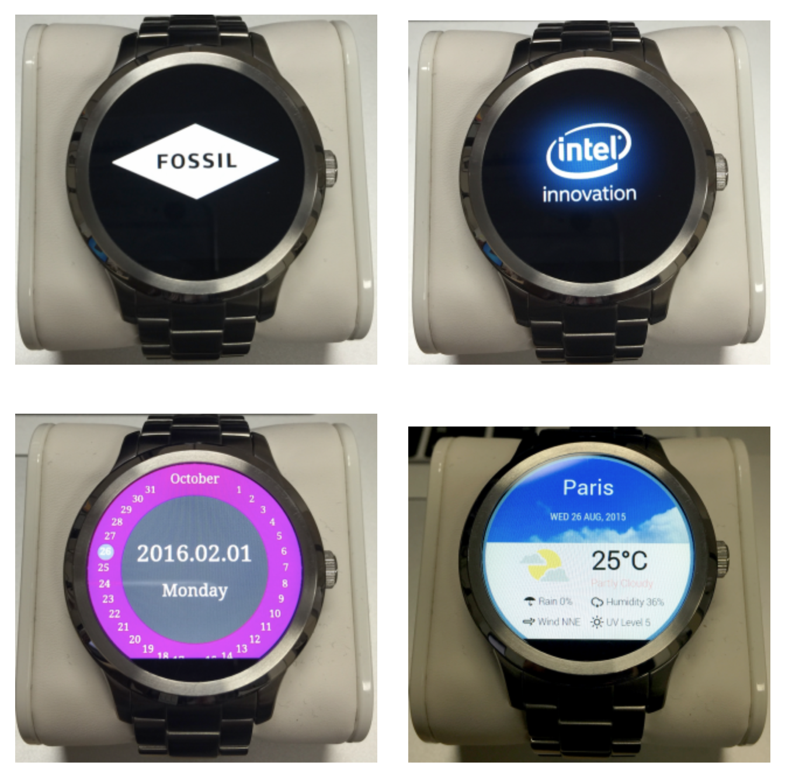

<small>via https://01.org/zh/chromium/blogs/joone/2016/css-round-display-specifications</small>

----

<div style="width: 80vw; margin: auto;">
  
  
  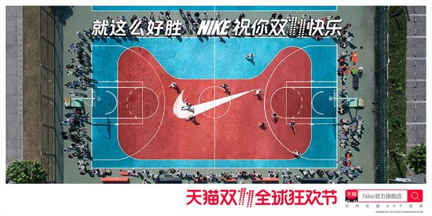
  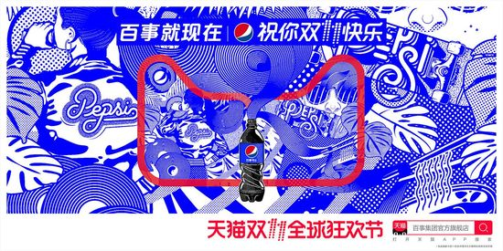
  
  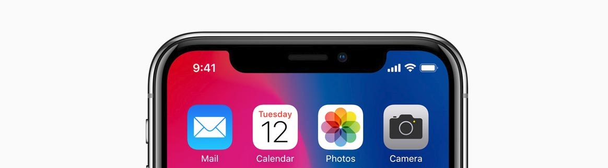
</div>

----

### [W3C CSS Round Display](https://drafts.csswg.org/css-round-display/)

- `viewport-fit: auto|cover|contain`
- `@media (shape: rect|round) { ... }`
- `shape-inside: display|...`
- `border-boundary: none|parent|display`

----

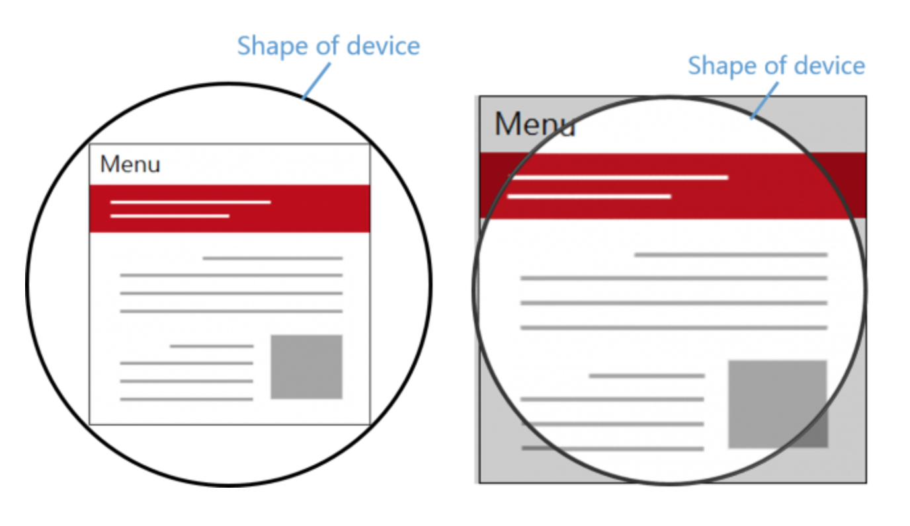

<small>via https://01.org/zh/chromium/blogs/joone/2016/css-round-display-specifications</small>

----

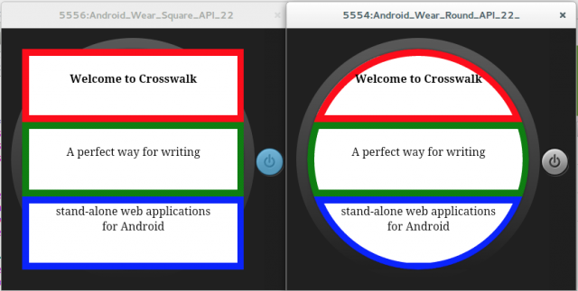

<small>via https://01.org/zh/chromium/blogs/joone/2016/css-round-display-specifications</small>

----

1. float
1. page
1. scroll
1. font
1. viewport

----

# Thanks

-  [zhaojinjiang](https://twitter.com/zhaojinjiang)
-  zhaojinjiang@me.com
-  [Jinjiang](https://github.com/Jinjiang)

<style>
.icon { height: 10vh; vertical-align: middle; }
.speaker {
  width: 20vh; height: 20vh;
  border-radius: 50%; border: 1vh solid rgba(0,64,192,.5);
  animation: speaker-rotate .5s infinite;
  vertical-align: middle;
  margin: -10vh 0;
}
@keyframes speaker-rotate {
  0% { transform: rotate(-10deg); }
  50% { transform: rotate(10deg); }
  100% { transform: rotate(-10deg); }
}
</style>
