# Human Readable Data

----

## 个人简介

* 赵锦江
* [W3C HTML 中文兴趣组](http://www.w3.org/html/ig/zh/)
* 无线事业部 阿里巴巴 杭州
* [@勾三股四](http://weibo.com/mx006)
* [jiongks.name](http://jiongks.name)

----

# 故事

----

### 故事

从一次持续集成 (ci) 的尝试开始

----

### 故事

- 一个前端工程
- 已经有了自动化语法和编码规范检查
- 已经有了自动化测试

----

### 故事

第一次试用公司某个新的持续集成平台

----

### 故事

入门文档是这样写的：

1. 在项目仓库里加入 ci 的钩子，保证每次推送代码都会触发 ci
2. 为项目撰写 ci 配置文件

----

### 故事

`*.yml` 配置文件

----

### yml 配置文件

大致需要配置的信息包括：

- stage: node-4、node-0.12……
- step: 环境准备、静态检查、单元测试、打包、安装、启动、集成测试……
- label: exec

----

### yml 配置文件

对 YAML 文件格式一直比较陌生……

----

### yml 配置文件

本来打算照猫画虎随便弄一下

----

### yml 配置文件

结果反复试来试去不成功  
(事后发现是样例找错了 - -)

----

### yml 配置文件

于是我又联想到了之前的一些经历……

----

### yml 配置文件

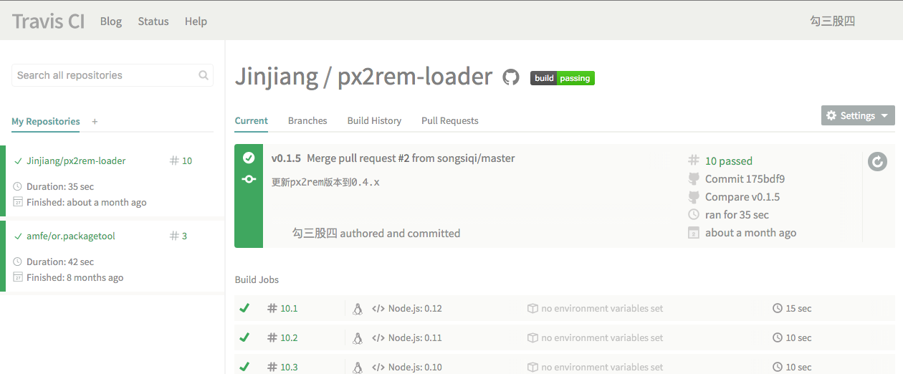

----

### yml 配置文件

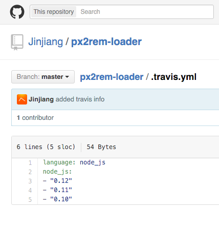

----

### yml 配置文件

----

### yml 配置文件

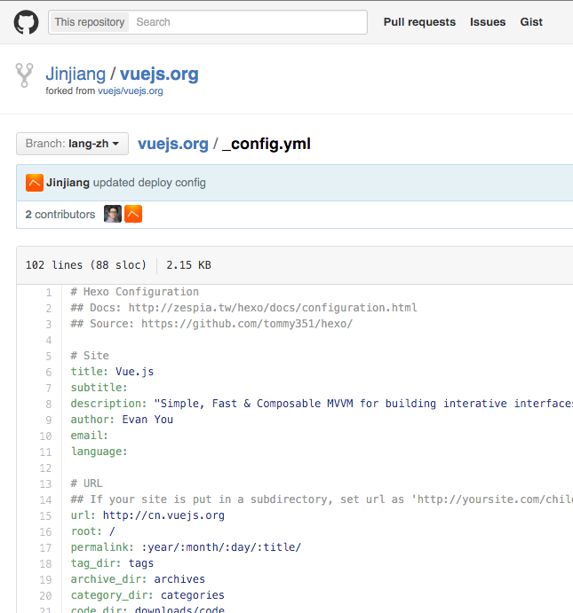

----

### yml 配置文件

还有很多地方见到过 `*.yml`

----

### yml 配置文件

今后一定还会不断见到它，如果每次遇到还是仅仅模仿一下，一定还会遇到更多问题

----

### yml 配置文件

所以决定认真学习一下 YAML

[http://yaml.org](http://yaml.org)

----

# YAML

----

### 序列表和映射表

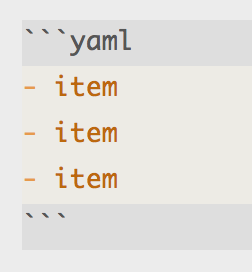

----

### 序列表和映射表

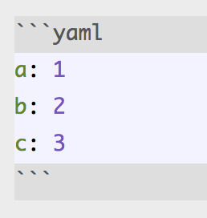

----

### 每行一条且支持缩进

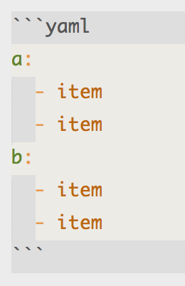

----

### 每行一条且支持缩进

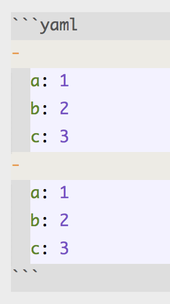

----

`#` 代表注释

----

### `---` 代表段落分隔

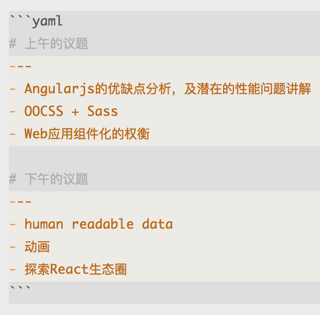

----

### 数据格式

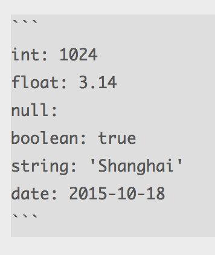

----

### 多种字符串的表达方式

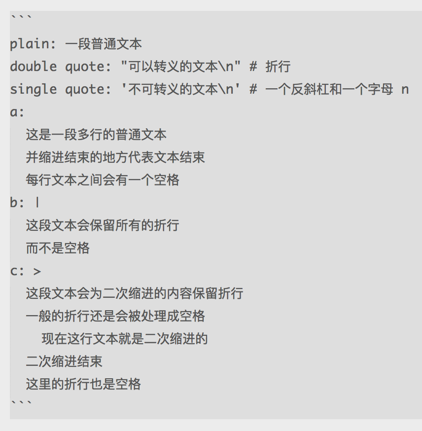

----

### 重复的内容 `&` 和 `$`

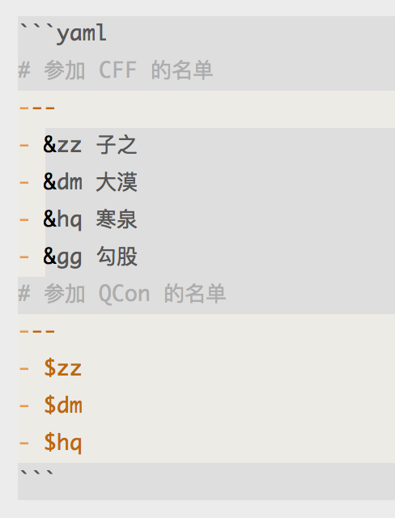

----

### 更多

[http://yaml.org](http://www.yaml.org/spec/1.2/spec.html)  
[在线试用](http://nodeca.github.io/js-yaml/)

----

# 回到故事

----

这个时候再回来看 ci 里的配置文件  
对理解和撰写配置文件有很大帮助  
一目了然！分分钟搞定！

----

YAML 就是一种 human readable data

----

# What?

----

让计算机世界中的数据尽量可以被人类直观的阅读理解

----

什么样的数据可以同时被人类和计算机阅读理解呢？

----

- 前提，能够被计算机解析
- 首先，数据应该是文本的
- 其次，这段文本是能够描述出结构化信息的

----

YAML 以文本作为数据载体，能够表述一定的数据结构，拥有基于多种语言的解析器和工具，是一种典型并且应用广泛的“human readable data”

----

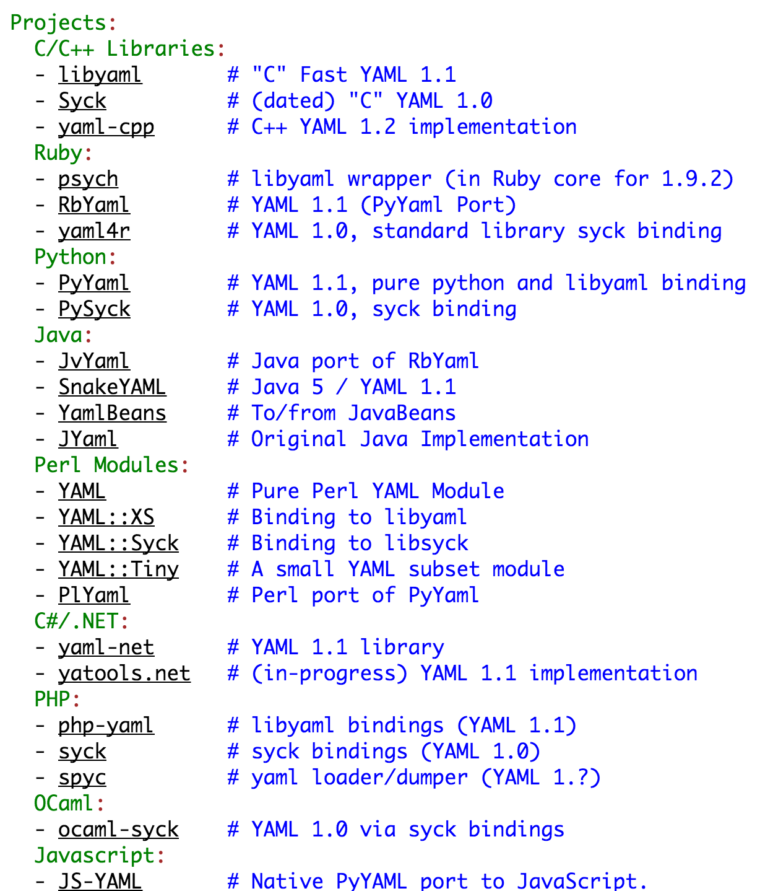

----

human readable data 适用于人工阅读和维护的程序配置信息，简单、直观、可被程序识别

----

JSON 也是这样的

- Node.js 中的 `package.json`
- Bower 中的 `bower.json`
- ...

