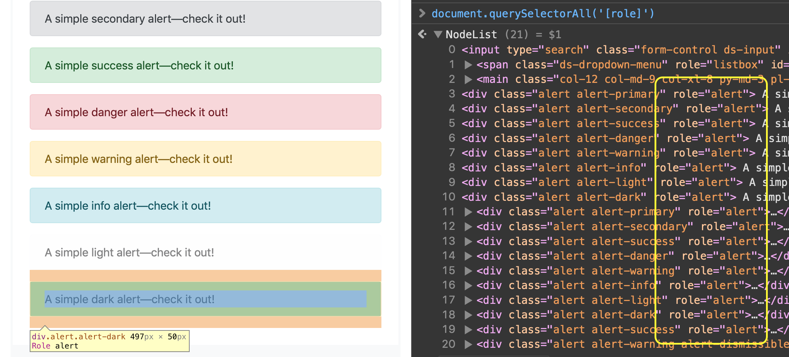
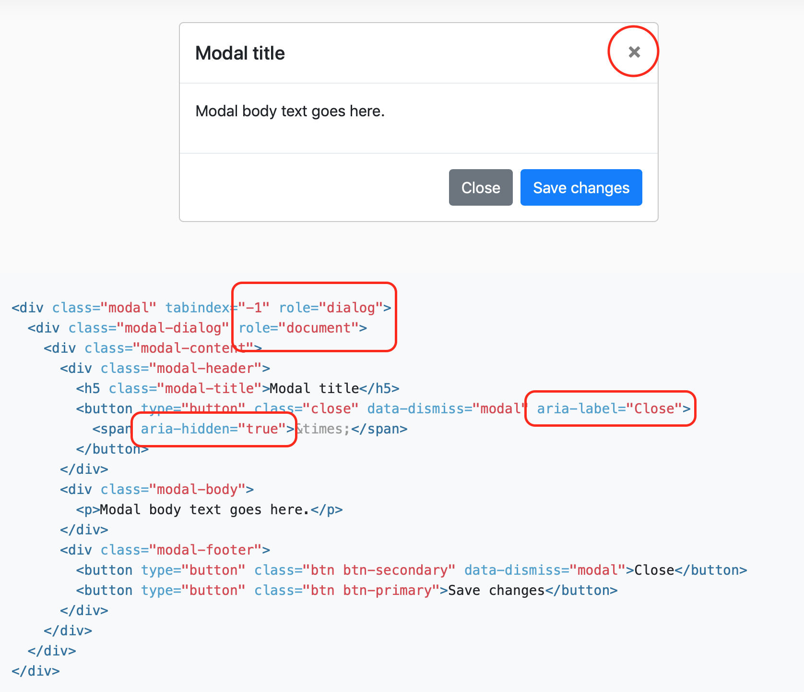
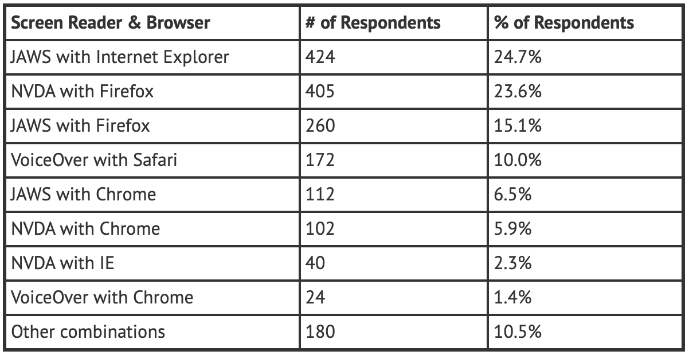

## Making Your  App Accessible

@勾三股四

Vue core team & AlibabaCloud

----

### Agenda 议程

* background 背景
* web standards 规范
* strategy 策略
* utils & demo 工具 & 示例

----

### Background 背景

* ♿️ / 🌐 = 15%
* 2-4% severely so 相对严重
* 👁 图像 👣 行动 👂 声音 🧠 认知
* or ...

----

### Background 背景

... normal people in such a situation

... 常人在上述方面的特殊环境下

👤 / 🌐 ≈ 100%

----

### Background 背景

So it's actually meaningful for EVERYONE.

所以这是对每个人都有意义的事情。

----

### Background 背景

| 👁 | 👣 | 👂 | 🧠 |
| --- | --- | --- | --- |
| 🖥 🔎 | 🖱 📱 ⌨️<br />🎮 🖊 🎛 | 🔈 🎙 | layout 布局<br />content 内容<br />details 细节 |

----

### 👣 Motor 关于行动

* PC: mouse 鼠标 only?
* Mobile: touch 触控 only?
* TV: remote control 遥控器 only?
* Keyboard ≈ efficiency 效率

----

### 👣 Motor 关于行动

Creativities 交互创新: Apple Pencil, Voice 语音, Finger ID, Face ID ...

Any backup 有备选方案吗?

----

### Web Standards 标准

* [WCAG](https://www.w3.org/TR/WCAG21/): Web Pages 网页
* [UAAG](https://www.w3.org/TR/UAAG20/): Browsers 浏览器, Screen Readers
* [ATAG](https://www.w3.org/TR/ATAG20/): CMS, WYSIWYG 所见即得工具

----

### Web Standards 标准

* [WAI-ARIA](https://w3c.github.io/aria/): Web App 富应用
* widget, role, props, states

<small>highly recommended to read<br />强烈推荐深入学习</small>

----

  
<small>via getbootstrap.com</small>

----

  
<small>via getbootstrap.com</small>

----

  
<small>[Big SVG Picture](https://www.w3.org/TR/wai-aria-1.2/img/rdf_model.png)</small>

----

  
<small>https://webaim.org/projects/screenreadersurvey7/#browsercombos</small>

----

### Strategy 实践策略

1. Atoms 原子组件
1. Groups 组件容器
1. Relationships 业务关系描述
1. App Layout 应用框架

<small><i>灵感源自 inspired from: [atomic design](http://atomicdesign.bradfrost.com)</i></small>

----

### Strategy 1: Atoms

* HTMLElement: tag name, attrs
* Component: role, props, states, tabindex

<small>use them properly 把它们的语义用好用对</small>

----

```html
<label for="foo">
  Foo
</label>
<input
  id="foo"
  type="checkbox"
  checked
/>
```

----

```html
<div id="label">
  Foo
</div>
<div
  tabindex="0"
  role="checkbox"
  aria-labelledby="label"
  aria-checked="true"
  class="checkbox"
></div>
```

----

#### Btw you would<br />use _ARIA_ a lot from now on ...

接下来你会用到好多 _ARIA_

----

### Strategy: Atoms

Supply text alternatives: icons, images, photos, charts ...

提供必要的文本替代品

----

### Strategy 1: Atoms

Supply long description for some short text

为一些缩写或简短的文字<br />配以更详细的描述

----

### Strategy 2: Groups

menu / tree / list / table / grid / ...

<small>a [treegrid example](https://w3c.github.io/aria-practices/examples/treegrid/treegrid-1.html) via W3C</small>

----

*All above could be encapsulated by a component.*

*上述两方面内容均可封装在组件库内*

by component lib authors.

----

### Strategy 3:<br />Relationships

* `aria-flowto`
* `aria-controls`, `aria-owns`
* `aria-activedescendant`
* `aria-errormessage`

<small>interaction logic 描述交互逻辑关系</small>

----

<small>a [listbox example](https://w3c.github.io/aria-practices/examples/listbox/listbox-scrollable.html) via W3C</small>

----

### Strategy 3:<br />Relationships

* `aria-labeledby`
* `aria-describedby`
* `aria-details`

<small>descriptions more than label<br />更多的文本描述关系</small>

----

*The relationships should be specified with business logic together.*

*这部分关系描述是需要业务研发团队根据实际情况来完成的*

by business dev team.

----

### Strategy 4: Layout

* landmarks 应用全局布局
* "skip to content" 开门见山
* current 路由描述

----

### Strategy 4: Layout

* [live region(s)](https://developer.mozilla.org/en-US/docs/Web/Accessibility/ARIA/ARIA_Live_Regions) 实时播报

<small>to announce dynamic content changes through assistive technologies<br />
用来通过读屏软件播报动态内容的变化</small>

----

*It should be supplied in the scaffold.*

*这部分内容应该封装在应用脚手架内*

by scaffold generator/authors.

----

### Strategy: 总结

* Atoms, Groups: component lib 组件库
* Relationships: business team 业务团队
* App Layout: scaffold 脚手架

----

## So ...

----

### Routines 常规操作

* `role`, `aria-*` 特性
* ID refs 全局唯一引用
* `tabindex`, focus control 焦点控制
* modal dialog 模态对话框
* keyboard shortcuts 快捷键
* live region 实时播报

----

### That's Why I Wrote

## [Vue A11y Utils](https://jinjiang.github.io/vue-a11y-utils/)

----

## Let's Demo Now

----

### Example 1:<br />`<VueAria>` Component &<br />`MixinId` Mixin<br />`MixinTravel` Mixin

[open](https://codesandbox.io/embed/3yvly4zzlq?module=%2Fsrc%2FApp.vue)

----

### Example 2:<br />`<VueAria>` Component &<br />`MixinId` Mixin<br />`<VueFocusTrap>` Component

[open](https://codesandbox.io/embed/4x0r6kprkw?module=%2Fsrc%2FApp.vue)

----

### Example 3:<br />`MixinShortcuts` Mixin

[open](https://codesandbox.io/embed/5mkxjq5l1x?module=%2Fsrc%2FApp.vue)

----

### Example 4:<br />`<VueLive>` Component

[open](https://codesandbox.io/embed/w7jx205nll?module=%2Fsrc%2FApp.vue)

----

## You can see the docs here:

https://jinjiang.github.io/vue-a11y-utils/

----

## And more examples:

https://jinjiang.github.io/vue-a11y-examples/

----

### Conclusions 总结

* background 背景
* web standards 规范
* strategy 策略
* utils & demo 工具 & 示例

----

### And don't forget 额外的

* pushing designer for 推动设计团队
  * accessible color pattern 配色方案
  * accessible interactions 交互改进
* testing 测试
* continuous iterations 持续迭代

----

### References

* [Vue Accessibility Guide (wip PR)](https://github.com/vuejs/vuejs.org/pull/1002)
* [Element](https://github.com/ElemeFE/element), [VEUI](https://github.com/ecomfe/veui), [eslint plugin](https://github.com/maranran/eslint-plugin-vue-a11y)
* W3C [aria](https://w3c.github.io/aria/) & [practices](https://w3c.github.io/aria-practices/)

----

# Thanks

 jinjiang
✉️ zhaojinjiang@me.com

<!--
resources:
- vue.svg
- screenshot-bootstrap.png
- screenshot-bootstrap-2.png
- a11y-survey-combinations.png
- github.svg
-->
