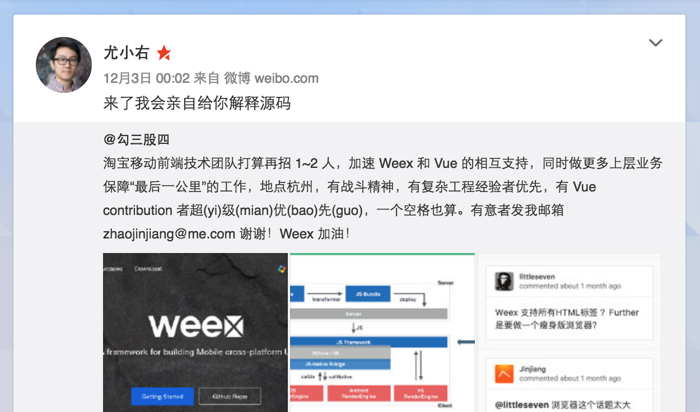

# <small>移动开发与 Weex 的改变和被改变</small>
  
[@勾三股四](http://weibo.com/mx006)  

----

<!-- backgroundImage: ./jinjiang.jpg -->
<!-- style: background-color: #09c; background-size: contain; background-position: center right; -->

## 自我介绍

* 微博 [@勾三股四](http://weibo.com/mx006)
* 淘宝·杭州
* 个人博客：[囧克斯](http://jiongks.name/)
* 业余爱好：足球、音乐

----

## 话题介绍

* 移动开发的趋势和痛点
* Weex 的诞生过程
* Weex 的被改变

----

# 移动开发

趋势和痛点

----

<!-- backgroundImage: ./project.jpg -->

## 大规模业务并行支撑

* 业务独立拆分
* 独立研发、测试和发布
* 无缝串联和衔接
* 发布节奏

----

<!-- backgroundImage: ./mobile.jpg -->

## 移动设备的网络问题

* lie-fi
* 主动 vs 被动
* 更丰富和实时
* 1s 法则

----

<!-- backgroundImage: ./develop.jpg -->

## 性能和研发效率

* 一次撰写多端可运行
* 包大小问题
* 大量 HTML5 业务何去何从
* “早晚被 native 重构”

----

## 三大命题

* 工程特性
* 业务特性
* 技术特性

----

# Weex 的诞生

----

## 2013 年启动

我们当时也叫 WeApp - -

----

### 早期设计

* `JSON` -> View
* 设计每一个字段的含义
* 三端各自识别和实现

----

### 例子

手机淘宝店铺首页

----

## 遇到的问题

----

### 非标准

HTML5 性能低
上层可利用资源少
学习成本高
功能局限性

----

### 不可扩展

核心团队不停的做组件  
疲于奔命

----

### 交互能力差

JSON 不适合描述命令式的复杂逻辑

----

## 总结经验教训

* 拥抱标准
* 横向可扩展
* 复杂逻辑描述

----

### 引入 JavaScript

* 三端都可支持
* JSCore/v8
* 交互逻辑处理
* 支持指令式书写

----

### 尊重 Web 标准

* 各大科技公司智慧的结晶
* 对各大平台友好
* 从上层语法到底层实现

----

### 重新设计技术架构

方便横向扩展
定义扩展规范

----

<!-- backgroundImage: ./homepage.png -->

## 同时更名为 Weex

----

<!-- backgroundImage: ./homepage.png -->

> You gave us a few weeks, and we bring to you a few **Weex**.

----

<!-- backgroundImage: ./1111.jpg -->

### 连续两年服务双十一

无故障，无技术发布
会场秒开！

----

<!-- backgroundImage: ./1111.jpg -->

> 史上最“无聊”的一次双十一  
> -- 某阿里员工

----

<!-- backgroundImage: ./weex-vue.jpg -->
<!-- style: background-size: contain; -->

### 额外的：更好的前端开发体验

Weex 和 Vue 的官方合作  
“把高大上的东西做得平易近人”

----

## Weex 带来的改变

* 简单·开放
* 新的研发模式
* 新的技术生态

----

## 简单本身就是有力量的

----

# Weex 的被改变

----

### 开源

* 意识到潜在的共性需求
* 希望发挥更大的作用
* 一起加速并推动技术发展

----

### 改变我们的方法论

* 功能迭代
* 技术布道
* 意见反馈

----

### 改变我们的沟通方式

* 同步：“能电话不邮件”
* 异步：issues/gitter
* 异地：北京、杭州、上海
* 异时区

----

你可能需要养成早起的习惯

----

### 改变对“完成”的定义

1. 功能完备
1. 网站和文档
1. 齐全的示例和文章
1. 工具和服务
1. “我要推荐给别人”

----

### 改变我们的工作内容

* Roadmap
* Proposals
* tools & services
* bugs & feedbacks

----

<!-- backgroundImage: ./future.jpg -->

# 未来努力的方向

----

<!-- backgroundImage: ./future.jpg -->

## 更完善的工程链路

* 测试、发布、统计、监控
* 缓存、性能分析、搭建平台

----

<!-- backgroundImage: ./future.jpg -->

## 更友好丰富的社区

* 更多开发者参与其中
* 更多优质资源的共享

----

## Weex 已经不是以前的 Weex

----

## 但 Weex 比任何时候都更健壮

----

## One More Thing...

----

<!-- backgroundImage: ./apache.png -->

Weex 捐赠 Apache 基金会

### 我们走出了第一步

[Link](http://mail-archives.apache.org/mod_mbox/incubator-general/201611.mbox/browser)

----

<!-- backgroundImage: ./apache.png -->

### 开源之路不易

### 且行且珍惜

共勉

----

<!-- backgroundImage: ./team.jpg -->
<!-- style: background-size: contain; -->

## 在此感谢开源

也感谢开源社区为 Weex 做出贡献的每一个人

&nbsp;

### 也欢迎更多人参与 Weex！

The END

