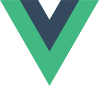

<!-- title: 我为什么选择 Vue.js -->
<!-- style: background-image: linear-gradient(#ffffffcc, #ffffffcc), url(./bg.jpg); background-position: 0 0; background-size: cover; -->

# 我为什么选择 

<small>赵锦江 - ModernWeb 2018</small>

<comment>背景图来自 Vue Meetup</comment>

----

<!-- style: background-image: url(./me.jpg); background-position: left center; background-size: contain; padding-left: 60vw; -->


赵锦江<br />
Jinjiang<br />
勾<small>三</small>股<small>四</small><br />
&nbsp;

<comment> <s></s>  ⚽️ 🎹 杭州</comment>

----

今天的话题和  有关

# 旧闻 + 新闻

----

* 旧闻：选择  的心路历程
* 新闻：2018  最新动态

----

<!-- style: background-image: linear-gradient(#ffffff88, #ffffff88), url(./2013-flat-vs-real-design.jpg); background-position: center center; background-size: cover; -->

<comment>http://www.flatvsrealism.com/</comment>

# Story 2013

----

<!-- Zepto -->

## 背景

* 我刚刚入职手机淘宝不久
* Mobile App 刚刚起步
* Mobile Web：Zepto

----

<!-- style: background-image: linear-gradient(#ffffff88, #ffffff88), url(./mobile-phone.jpg); background-position: 0 0; background-size: cover; -->

### 如何把 web app 的模式带到 mobile web/app？

<comment>pexels.com</comment>

----

<!-- style: background-image: linear-gradient(#ffffff99, #ffffff99), url(./backbone.png); background-position: 0 0; background-size: cover; -->

### [Backbone.js](http://backbonejs.org) 如何？

当时 MVC 框架对于前端来说都还是很高级的东西

----

来看一段真实的代码

----


----


----


----


----

### *问题被规模放大*

大量重复繁琐的代码

----

并不是最理想的解法

一定还可以更简单直接

----

同时……

### MVVM 架构逐渐进入视野

----

### MVVM 架构

```
[View] (presentation)
 ↑messages ↓commands ↑↓data-bindings
[ViewModel] (unsaved data)
 ↑↓sync
[Model] (data)
```

----

### *对问题的思考*

* 引入 MVVM 架构
* 先引入 data-binding
* 更多的约定 -> 简单直接的语法
* 体积要小，执行效率要高

----

<!-- style: background-image: linear-gradient(#ffffffcc, #ffffffcc), url(./ng-ko.png); background-position: 0 0; background-size: cover; -->

### 当时 data-binding 的主流方案

* ng: digest / dirty check
* ko: JSON -> `observable(...)`

----

### 我的想法

* 简洁：保持 JSON 的格式
* 高效：No dirty check

<small>尽量通过 `Object.defineProperty` 响应</small>

----

<!-- /jinjiang.zjj/lib-noble -->

于是我启动了一个内部的小项目

解决数据响应问题

----

<!-- /jinjiang.zjj/lib-noble/blob/master/lib/w.js -->

### 截取一小段代码注释

<small>
<pre><code>/**
 * 为一个数据对象设置无法被枚举的 `__watchers__` 属性。
 * 用来记录这个 `data` 对象上所有的监听器。
 * @private
 *
 * @param  {object} data
 */</code></pre>
</small>

----

<!-- /jinjiang.zjj/lib-noble/blob/master/lib/a.js -->

### 截取一小段代码注释

<small>
<pre><code>/**
 * 将数组 `arr` 进行可监听初始化。
 * 使其项目发生改变时触发事件，
 * 主要受影响的接口有：
 * `push`, `pop`, `shift`, `unshift`, `sort`, `reverse`；
 * 另外由于封装 `arr[index]` 和 `length` 有一定难度，
 * 故将这部分操作改为 `setItem(index, value)` 和 `setLength(length)`。
 * @alias module:W.formatArray
 * @function
 *
 * @param  {array} arr
 */</code></pre>
</small>

----

### *关键实现原理*

* `Object.defineProperty`
* `__watchers__`
* `setItem()` + `setLength()`

----

<!-- https://github.com/vuejs/vue/blob/v0.10.0/src/observer.js#L35:L47 -->
<!-- style: background-image: url(./vue-0.10.png); background-position: center center; background-size: cover; -->

与此同时，我发现了  [v0.10](https://github.com/vuejs/vue/blob/v0.10.0/src/observer.js#L35:L47)

----

### *关键实现原理*

* `Object.defineProperty`
* `__emitter__`
* `$set()` + `$remove()`

----

<!-- style: background-image: linear-gradient(#ffffff88, #ffffff88), url(./1-me-too.jpg); background-position: center center; background-size: cover; -->

## 不谋而合 👻

<comment>pexels.com</comment>

----

* 不谋而合的“认同感”
* 框架和 API 设计也有很多想法一致
* 极简主义 小巧高性能
* 比自己 (还没) 写的更成熟可靠

----

所以我选择了 

That's it?

----

其实不然……

我还没有和团队讨论 

----

当我兴奋的把 

拿给同事们看的时候……

----

> 问：这是哪家公司做的？
>
> 我：🤔
>
> 问：它真的比 Google 做出来的东西🐂吗？
>
> 我：😳
>
> 问：它值得我花时间学吗？
>
> 我：😓
>
> 问：太棒了！所以我选择 Zepto
>
> 我：🙀

----

后来大家还是没有选择  ☹️

----

只有我自己不甘心

默默坚持用了下去 🧐

----

<!-- style: background-image: linear-gradient(#ffffff88, #ffffff88), url(./2014-material.png); background-position: 0 0; background-size: cover; -->

# Story 2014

----

<!-- /jinjiang.zjj/tool-json-butler -->
<!-- http://jsonmate.com -->

<!-- style: background-image: linear-gradient(#ffffff88, #ffffff88), url(./json-mate.png); background-position: 0 0; background-size: cover; -->

### 用  做的第一个项目

内部项目：JSON Butler

用在桌面端可视化编辑 JSON 数据

(类似 jsonmate)

<comment>jsonmate</comment>

----

 的特点和优势完全发挥了出来

项目进展异常顺利

----

<!-- style: background-image: url(./json-butler-code.png); background-position: 0 0; background-size: cover; -->

### 当时的代码组织方式

* 所有的 template 放在一起
* 所有的 JS 放在一起
* 所有的 CSS 放在一起

----

### *问题被规模放大*

随着项目的发展，代码的可维护性受到极大的挑战

----

### *问题被规模放大*

修改同一个组件的行为和样式要同时在两个不同的大目录里找文件

----

<!-- style: background-image: linear-gradient(#ffffff88, #ffffff88), url(./webcomponents.png); background-position: 0 0; background-size: cover; -->

与此同时

我通过  HTML 中文兴趣组

发现了 Web Components

----

<!-- style: background-image: linear-gradient(#ffffff88, #ffffff88), url(./webcomponents.png); background-position: 0 0; background-size: cover; -->

### 以及一个新的 JS 框架 [Polymer](https://www.polymer-project.org/1.0/docs/)

1. 万物皆组件 (tag)
2. 每个组件各放置 HTML/CSS/JS
3. 通过打包工具构建在一起

----

<!-- style: background-image: linear-gradient(#ffffff88, #ffffff88), url(./zorro-html.png); background-position: 0 0; background-size: cover; -->

自己根据这个思路做了个 side project：[zorro-html](http://zorro-html.github.io)

<small>基于 Polymer (Web Components 思想) 复刻 Bootstrap</small>

----

<!-- style: background-image: linear-gradient(#ffffff88, #ffffff88), url(./polymer.png); background-position: 0 0; background-size: cover; -->

### *问题被规模放大*

Polymer 组件的[代码](https://github.com/zorro-html/z-panel/blob/master/z-panel.html)还是信息密度不够高，有很多不得已重复和繁琐的写法

----

### *对问题的思考*

一、未来的 web app

UI 都是由组件组合出来的

----

### *对问题的思考*

二、每个组件一个文件，里面就一小段 `<template>`、一小段 `<style>` 和一小段 `<script>`

----

<!-- style: background-image: linear-gradient(#ffffff88, #ffffff88), url(./vue-loader.png); background-position: center center; background-size: contain; -->

<small>You may guess what I've found next:</small>

### vue-loader

----

<!-- style: background-image: linear-gradient(#ffffff88, #ffffff88), url(./1-me-too.jpg); background-position: center center; background-size: cover; -->

## 不谋而合<sup>2</sup> 👻

<comment>pexels.com</comment>

----

我迫不及待的把 

再次推荐给团队

----

所以我们选择了 ?

Happy Ending?

----

> 勾股，你说的这个东西确实不错，但是用起来还是挺麻烦的，有好多工作要准备。你看人家 Google 的东西都是一整套的，拿来就能用，而且大家相互不用多说就都会用。

----

### *问题被规模放大*

我们需要的不仅仅是一个好的框架，而是一整套方案，包括库、工具、文档、流程设计、布道等等。

----

<!-- style: background-image: linear-gradient(#ffffff88, #ffffff88), url(./2015-apple-watch.png); background-position: top center; background-size: cover; -->

# Story 2015

----

### 开始丰富工程基础和布道

<small>
<ul>
  <li>《NPM+CommonJS 不好意思 我们来晚了》</li>
  <li>《Just‐vue vue+webpack 工程落地》</li>
  <li>《无线前端的图片相关工作流程梳理》</li>
  <li>《Vue.js 码源学习笔记》</li>
  <li>……</li>
</ul>
</small>

----

<small>并有幸请来了作者尤雨溪做交流</small>


----

经过自己不断的努力，手机淘宝前端团队终于有越来越多的人选择了 

----

<!-- style: background-image: linear-gradient(#ffffff88, #ffffff88), url(./think-about-vue.png); background-position: center center; background-size: auto; -->

经过这次深度学习和实践 

也产生了一些自己的想法

----

<!-- style: background-image: linear-gradient(#ffffff88, #ffffff88), url(./think-about-vue.png); background-position: center center; background-size: auto; -->

### *对问题的思考*

1、模板的实现也许可以脱离 document fragment 因为 dom 操作比 JavaScript 运算要慢得多

----

<!-- style: background-image: linear-gradient(#ffffff88, #ffffff88), url(./think-about-vue.png); background-position: center center; background-size: auto; -->

### *对问题的思考*

2、如果把模板的解析工作尽可能多的提前处理好，那么 runtime 可以更小更快

----

<!-- style: background-image: linear-gradient(#ffffff88, #ffffff88), url(./think-about-vue.png); background-position: center center; background-size: auto; -->

### *对问题的思考*

3、对 template -> JSON 的抽象也许能够使得 Vue 的开发体验移植到其它各类 UI 编程的场景中。

----

<!-- style: background-image: linear-gradient(#ffffff33, #ffffff33), url(./vue-native-weibo-before.png); background-position: center center; background-size: auto; -->

# Story 2015<sup><small>6月</small></sup>

----

<!-- style: background-image: linear-gradient(#ffffff33, #ffffff33), url(./vue-native-weibo-before.png); background-position: center center; background-size: auto; -->

 + Native? 🤔

----

<!-- style: background-color: #333; background-image: linear-gradient(#ffffff88, #ffffff88), url(./shenjs.png); background-position: center center; background-size: contain; -->

参加了深圳某 JS 会议

碰到了很多同行 也再次碰到了尤雨溪

----

从大家的交流中得到了很多启发和鼓励

也坚定了自己的想法

----

发起了一个内部试验项目

尝试将当时的  和

手机淘宝的 native 技术

进行改造和融合

----

<!-- style: background-image: linear-gradient(#ffffff88, #ffffff88), url(./vue-native-email.png); background-position: 0 0; background-size: cover; -->

会后连夜设计了

JS bridge API 的第一个版本

----

<!-- style: background-color: #EB1440; background-image: url(./1111.png); background-position: 130% 125%; background-size: 50%; -->

最终成品：[Weex](https://weex.apache.org/)

2015-11-11  “首发”

----

<!-- style: background-image: linear-gradient(#ffffff33, #ffffff33), url(./vue-native-weibo-after.png); background-position: center center; background-size: auto; -->

终于有人知道我做什么了😂

----

所以  也选择了 -like

<small>for mobile app only</small>

----

那么 mobile web + desktop？

 了解一下 🤪

----

<!-- style: background-image: linear-gradient(#ffffff33, #ffffff33), url(./2016-pokemon-alphago.jpg); background-position: center center; background-size: cover; -->

# Story 2016

----

大家仍会对  的能力提出质疑……

----

### 最关键的一个问题

> 问：能否支持 IE8？
>
> 我：也许可以 &%\*$\#@ 试试看……

----

事情不了了之……

----

但在我心里这实际上是一个

### “昨天的问题”

----

事实证明在当年年末

包括  在内的多条产品线

放弃了对 IE8 的支持……

----

在 2016 年

我有幸加入了  团队 🎉

有了更多交流的机会

----

紧接着  v2.0 启动

并于同年正式发布

----

###  v2.0

* virtual-DOM
* 更多编译时 + 更小运行时
* 跨平台渲染支持

----

<!-- style: background-image: linear-gradient(#ffffff88, #ffffff88), url(./1-me-too.jpg); background-position: center center; background-size: cover; -->

## <s>不</s>有谋<s>而</s>有合 👻

<comment>pexels.com</comment>

----

与此同时……

 全年的几个大型活动

基于 Weex 顺利完成

----

年底到了，大家再一次坐下来谈

 了解一下 🤪

----

> 我们觉得  能力完全没问题
>
> 但是生态不够繁荣……

----

在我看来这又是一个

### “昨天的问题”

而且……

----

* 去年的问题：核心能力
* 今年的问题：周边生态

----

> 我：我现在没有办法给你一个繁荣的生态，
>
> 但我打赌你明年不会再问这个问题了

----

最终 <sup>\*</sup>选择了 

<small>\*面向消费者端业务</small>

----

稍微多说一点……

<small>所以 2017 年  的 ecosystem 发展得怎么样呢？</small>

----

 团队把发展 ecosystem

作为 2017 年的重心之一

----

<!-- logo -->

### 越来越多的合作

<small>TypeScript / PWA / VSCode / Apollo / RxJS / Firebase / StoryBook / ...</small>

----

### 越来越多的库和工具

<small>Nuxt / Element / Vuetify / vue-i18n / ...</small>

<small>https://curated.vuejs.org<br />https://github.com/vuejs/awesome-vue</small>

----

### 越来越多的用户

<small>GitLab / Apple / NASA / IBM / Amazon / Weibo / 滴滴 / 快手 / ...</small>

----

<!-- style: background-image: linear-gradient(#ffffff66, #ffffff66), url(./fb-vue.png); background-position: left top; background-size: cover; -->

and (yes) facebook

----

<!-- style: background-color: #f9f9f9; background-image: url(./vue-conf.png); background-position: top center; background-size: contain; -->

&nbsp;

----

<!-- style: background-image: linear-gradient(#ffffff66, #ffffff66), url(./vue-members.png); background-position: top left; background-size: cover; -->

会上的很多人后来都成为了团队的一员

----

<!-- style: background-image: linear-gradient(#6666, #6666), url(./team.png); background-position: top left; background-size: cover; -->

团队不断壮大

  

----

 Ecosystem 2017

* 更多的合作
* 更多的库和工具
* 更多的用户
* 更蓬勃的社区

----

### That's why 

----

### But why why?

----

<!-- style: background-image: linear-gradient(#ffffff88, #ffffff88), url(./1-me-too.jpg); background-position: center center; background-size: cover; -->

### 1 不谋而合的认同感

<small>“放弃”自研，帮助别人一起做到更好，这同样是很酷的事情</small>

----

<!-- style: background-image: linear-gradient(#ffffff88, #ffffff88), url(./2-standard.jpg); background-position: center center; background-size: cover; -->

### 2 尊重标准 对新技术敏感

<small>意味着更多的借力、和更多人更快速达成共识、更强的生命力</small>

----

<!-- style: background-image: linear-gradient(#ffffff88, #ffffff88), url(./3-dev-x.jpg); background-position: center center; background-size: cover; -->

### 3 尊重开发者的习惯

<small>关注开发者体验<br>「机器不是主人，是工具，而真正的主人应该是"人"」</small>

----

<!-- style: background-image: linear-gradient(#ffffff88, #ffffff88), url(./4-scalable.jpg); background-position: center center; background-size: cover; -->

### 4 不知疲倦的思考<br>下一个可能会被放大的问题

<small>和被放大的需求、业务、设计、技术、工程管理问题等一起成长</small>

----

<!-- style: background-image: linear-gradient(#ffffff88, #ffffff88), url(./5-final-state.jpg); background-position: center center; background-size: cover; -->

### 5 保持绝对的简单和优雅

<small>始终努力寻找你能想象到的技术的最终形态</small>

----

<!-- style: background-image: linear-gradient(#ffffff88, #ffffff88), url(./6-core.jpg); background-position: center center; background-size: cover; -->

### 6 永远对核心的品质保持专注

<small>great community and ecosystem always<br>follows great low-level core naturally</small>

----

### 总结

* 关注问题和解法 -> 创造价值
* 尊重习惯/优雅/简单 -> 开发体验
* 尊重标准/关注新技术 -> 生命力
* 探求终极形态 -> 脱颖而出
* 专注核心 -> 社区/生态的源动力

----

<!-- style: background-color: #000; background-image: url(./josephj-marked.png); background-position: center center; background-size: contain; -->

<comment>https://www.slideshare.net/josephj/webrebuild</comment>

----

<!-- style: background-color: #000; background-image: url(./kwz-best.png); background-position: center center; background-size: contain; -->

<comment>木曜4超玩</comment>

----

<!-- style: background-image: linear-gradient(#ffffff66, #ffffff66), url(./bg.jpg); background-position: 0 0; background-size: cover; -->

### State of  2018

----

<!-- style: background-image: url(./cli.png); background-position: 0 0; background-size: contain; padding-left: 30vw; -->

<small>
<ul>
  <li>开箱即用，可零配置打开一个文件</li>
  <li>比 v2 更好的脚手架模板</li>
  <li>可以把所有配置信息写在同一个文件里</li>
  <li>通过自身插件系统进行扩展</li>
  <li>支持构建 native web components</li>
</ul>
</small>

----

<!-- style: background-image: url(./vuepress.png); background-position: 0 0; background-size: contain; padding-left: 30vw; -->

<small>
<ul>
  <li>Markdown + Vue 撰写内容</li>
  <li>高效研发 + 高性能运行</li>
  <li>多年文档经验积累，有很多贴心的细节</li>
</ul>
</small>

----

### Vue@next

<small>
<ul>
  <li>面向 ES2015+“现代浏览器”</li>
  <li>基于 Proxy 重写数据响应系统</li>
  <li>和 v2 保持同步更新</li>
</ul>
</small>

----

### Vue@3.0

尽情期待

----

### 文档

<small>
<ul>
  <li>guide：问题 -> 方案</li>
  <li>api：方案 -> 问题</li>
  <li>style guide：约定俗成</li>
  <li>cookbook：涵盖更多更丰富的场景和辅助内容</li>
</ul>
</small>

----

### 其它

<small>
<ul>
  <li>Vue Loader v15：配置方式更合理、SFC 规范独立</li>
  <li>Vue UI：已经用在了 Vue CLI v3 上</li>
  <li>Vue Test Utils：支持 Jest、Mocha 等多种测试框架</li>
</ul>
</small>

----

<!-- style: background-image: linear-gradient(#ffffff33, #ffffff33), url(./london.png); background-position: 0 0; background-size: cover; -->

### 官方线下活动

<small>
<ul>
  <li>Vue.js Summit - 8月底 圣保罗</li>
  <li>Vue.js London - 9月下旬 伦敦</li>
  <li>Vue Fes Japan - 11月初 东京</li>
</ul>
</small>

----

<!-- style: background-image: linear-gradient(#ffffff33, #ffffff33), url(./news.png); background-position: 0 0; background-size: cover; -->

### [Vue.js News](https://news.vuejs.org)

100+ newsletters

----

<!-- style: background-image: linear-gradient(#ffffffcc, #ffffffcc), url(./books.jpg); background-position: center center; background-size: cover; -->

# Thanks

<div style="font-size: 0.5em;">
   勾<small>三</small>股<small>四</small>
   Jinjiang
   zhaojinjiang
   zhaojinjiang@me.com
</div>

<small>希望大家能来 [OpenCollective](https://opencollective.com/vuejs) 多多支持 </small>

<style>
.svg-icon { height: 1em; vertical-align: middle; }
.svg-icon-small { height: 0.75em; vertical-align: middle; }
.svg-icon-large { height: 2em; vertical-align: middle; }
s { display: inline-block; position: relative; }
s::after { content: ""; position: absolute; top: 50%; left: 0; right: 0; height: 0.1em; background: currentColor; }
large { font-size: 2em; }
comment { display: block; position: absolute; bottom: 5%; right: 5%; color: grey; font-size: 3.5vh; }
</style>
