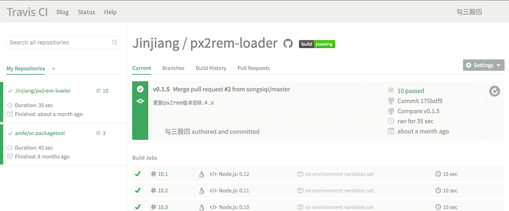
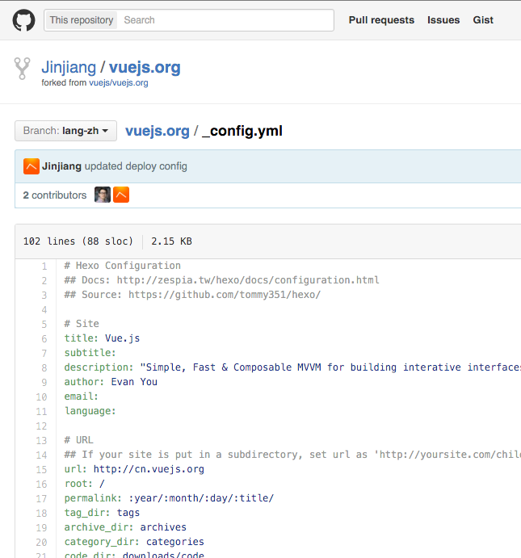
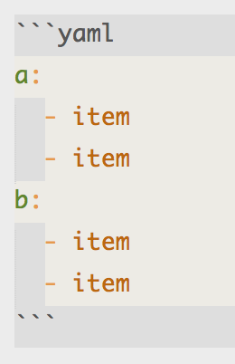
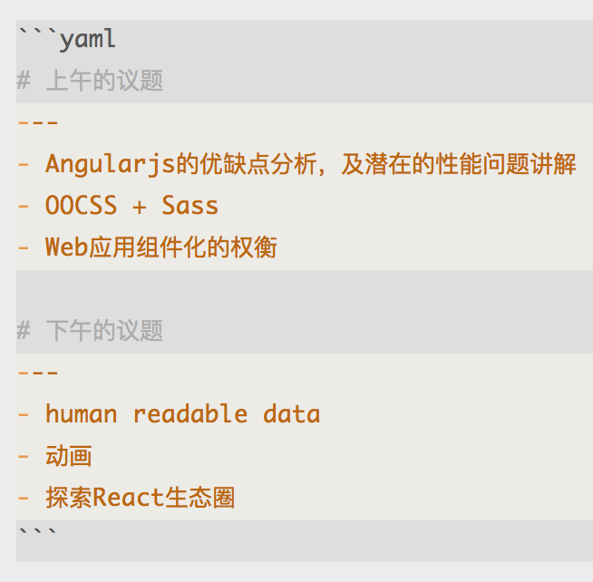
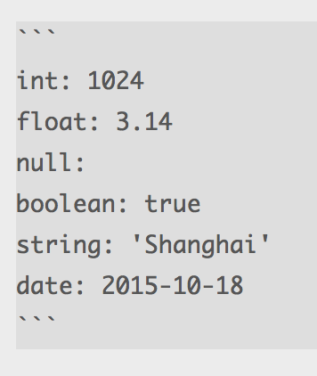
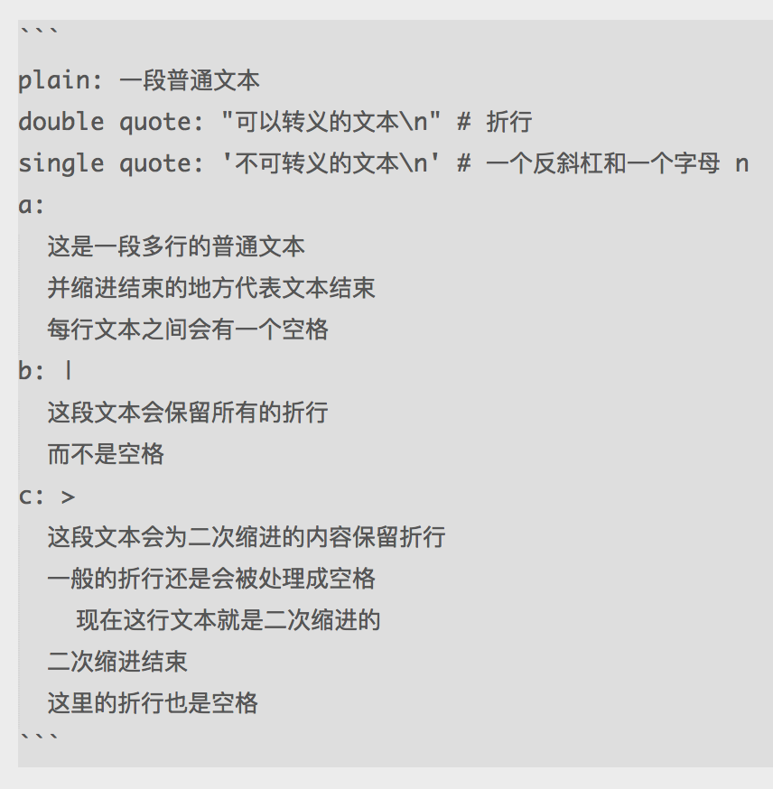
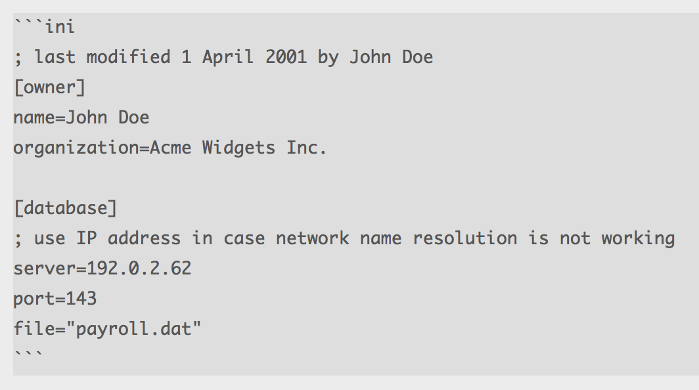
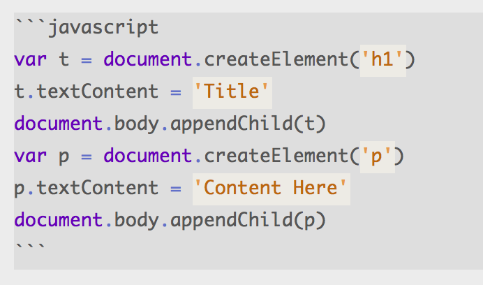
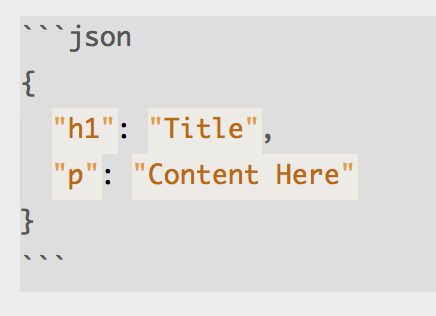
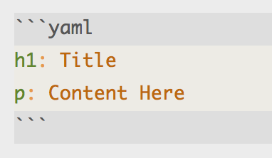

# Human Readable Data

----

## 个人简介

* 赵锦江
* [W3C HTML 中文兴趣组](http://www.w3.org/html/ig/zh/)
* 无线事业部 阿里巴巴 杭州
* [@勾三股四](http://weibo.com/mx006)
* [jiongks.name](http://jiongks.name)

----

# 故事

----

### 故事

从一次持续集成 (ci) 的尝试开始

----

### 故事

- 一个前端工程
- 已经有了自动化语法和编码规范检查
- 已经有了自动化测试

----

### 故事

第一次试用公司某个新的持续集成平台

----

### 故事

入门文档是这样写的：

1. 在项目仓库里加入 ci 的钩子，保证每次推送代码都会触发 ci
2. 为项目撰写 ci 配置文件

----

### 故事

`*.yml` 配置文件

----

### yml 配置文件

大致需要配置的信息包括：

- stage: node-4、node-0.12……
- step: 环境准备、静态检查、单元测试、打包、安装、启动、集成测试……
- label: exec

----

### yml 配置文件

对 YAML 文件格式一直比较陌生……

----

### yml 配置文件

本来打算照猫画虎随便弄一下

----

### yml 配置文件

结果反复试来试去不成功  
(事后发现是样例找错了 - -)

----

### yml 配置文件

于是我又联想到了之前的一些经历……

----

### yml 配置文件

----

### yml 配置文件

----

### yml 配置文件

----

### yml 配置文件

----

### yml 配置文件

还有很多地方见到过 `*.yml`

----

### yml 配置文件

今后一定还会不断见到它，如果每次遇到还是仅仅模仿一下，一定还会遇到更多问题

----

### yml 配置文件

所以决定认真学习一下 YAML

[http://yaml.org](http://yaml.org)

----

# YAML

----

### 序列表和映射表

----

### 序列表和映射表

----

### 每行一条且支持缩进

----

### 每行一条且支持缩进

----

`#` 代表注释

----

### `---` 代表段落分隔

----

### 数据格式

----

### 多种字符串的表达方式

----

### 重复的内容 `&` 和 `$`

----

### 更多

[http://yaml.org](http://www.yaml.org/spec/1.2/spec.html)  
[在线试用](http://nodeca.github.io/js-yaml/)

----

# 回到故事

----

这个时候再回来看 ci 里的配置文件  
对理解和撰写配置文件有很大帮助  
一目了然！分分钟搞定！

----

YAML 就是一种 human readable data

----

# What?

----

让计算机世界中的数据尽量可以被人类直观的阅读理解

----

什么样的数据可以同时被人类和计算机阅读理解呢？

----

- 前提，能够被计算机解析
- 首先，数据应该是文本的
- 其次，这段文本是能够描述出结构化信息的

----

YAML 以文本作为数据载体，能够表述一定的数据结构，拥有基于多种语言的解析器和工具，是一种典型并且应用广泛的“human readable data”

----

----

human readable data 适用于人工阅读和维护的程序配置信息，简单、直观、可被程序识别

----

JSON 也是这样的

- Node.js 中的 `package.json`
- Bower 中的 `bower.json`
- ...

----

----

还有一些类似的数据格式，比如 `ini` 文件  
[Wikipedia](https://en.wikipedia.org/wiki/INI_file)

----

----

当然，还有 `xml` 文件，这里不多做介绍

----

我们大前端已经有 HTML 和 JSON 了！为什么还需要 YAML？

----

### 大背景

因为前端的技术在发展  
不同的语言和技术之间在融合

----

### 人类可读性

总体上出现的特殊字符越少，结构越直观，可读性越强，也越适合人类书写，JSON/XML 并不占优势

----

### 程序可读性

JSON 在 JavaScript 中不需要另行解析，但在其它语言中也并没有优势

----

### 结构性

XML 的结构设计相对复杂一些，配套的设施积累比较多，语法更加严谨，适用于较为复杂的场景

----

随着前端的发展，我们会越来越多的和 YAML 数据打交道，同时也希望大家能够从“human readable data”的角度理解它的意义和价值

----

把 human readable 的理念运用在更多的地方

----

声明式 vs 命令式

----

----

----

更少的代码

----

----

更少的特殊字符

----

----

你还想到了哪些东西？

----

coffee / sass / jade / mustache / ...

----

# One more thing

----

Machine Readable Data

----

### Machine Readable Data

让一些看似无形的东西尽量被计算机理解

----

### Machine Readable Data

比如 条形码和二维码

----

### Machine Readable Data

以及在 Web 中被大量使用的

----

### Machine Readable Data

structured data on the Internet, on web pages, in email messages, ...

- [Microdata](https://html.spec.whatwg.org/multipage/microdata.html)
- [RDFa](http://www.w3.org/TR/rdfa-lite/)
- [Microformat](http://microformats.org/wiki/microformats2)

----

### Machine Readable Data

更多参考

- [Schema.org](https://schema.org/docs/gs.html) RDFa, Microdata and JSON-LD

----

### Machine Readable Data

- [WAI-ARIA](http://www.w3.org/TR/wai-aria/usage)

----

# Thanks
