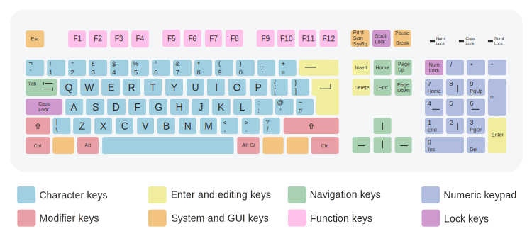
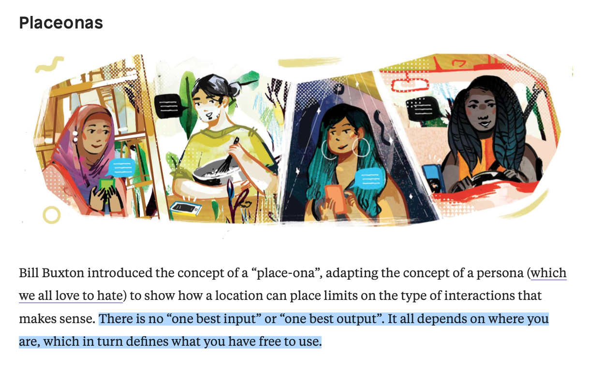
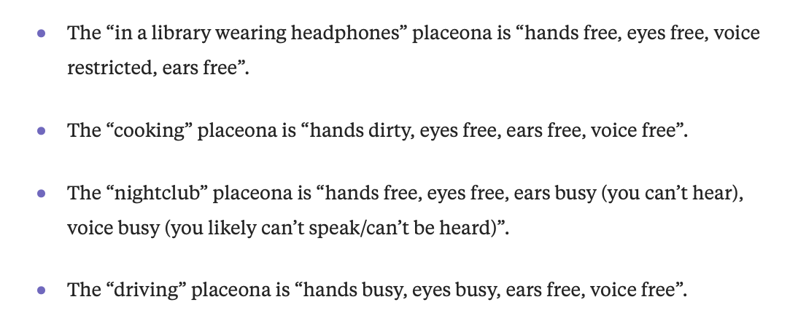
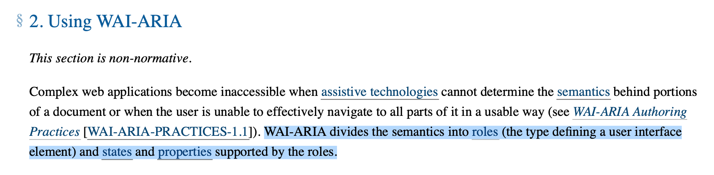

## 挖掘鍵盤的潛能

赵锦江 ModernWeb 2019

<!--

挖掘鍵盤的潛能

現今很多 Ｗeb 上的用戶交互基本都被觸屏和滑鼠所佔領，但實際上鍵盤操作一直被我們低估甚至忽略。
本主題會嘗試整理介紹使用者交互中鍵盤的相關用例，並展示相應的前端實現。

-->

----

   Jinjiang
   zhaojinjiang
   zhaojinjiang@me.com

  <iframe height="100vh" style="width: 50vw; height: 100vh;" scrolling="no" src="//codepen.io/Jinjiang/embed/OYWJwX/" frameborder="no" allowtransparency="true" allowfullscreen="true"></iframe>
  <iframe height="100vh" style="width: 50vw; height: 100vh;" scrolling="no" src="//codepen.io/Jinjiang/embed/XQGmOR/" frameborder="no" allowtransparency="true" allowfullscreen="true"></iframe>

----

<!-- Today's topic is about keyboard. -->

这份主题是和 <kbd>键盘</kbd> 有关的

----

<!-- style: background-image: url(touch.jpg), url(mouse.jpg); background-position: -50vw 0, 0 0; -->

<!-- All we interact with web (UI) today is more like touching or mousing. -->

我们今天的人机交互基本都是以鼠标和触控操作为主的。

----

<!-- style: background-image: url(vr.jpg), url(watch.jpg); background-position: -50vw 0, 20vw 0; -->

<!-- And there are many more smart ways to interact with machines. -->

并且还在不断产生更多更加智能的人机交互方式。

----

<!-- Keyboard is less used anymore. -->

<kbd>键盘</kbd> 操作越来越少被使用和讨论到。

----

<!-- backgroundImage: virtual-keyboard.png -->
<!-- style: background-size: contain; -->

<!-- But why we can not live without keyboard? -->

但是 <kbd>键盘</kbd> 真的能够完全被这些交互方式所取代吗？

----

<!-- As a discovery,

please do not care about the agenda...

Just start! -->

这是一个“探索性”的话题，请跟随我们一起开始吧！

----

<!-- The most commonly used cases is: -->

<kbd>键盘</kbd> 最最最常见的用例：

- `<input />`
- `onchange`
- `oninput`

----

<!-- _code sample: password validation_ -->

_代码示例：密码强度检测_

[演示](demo-1.html)

----

<!-- Sometimes it's not enough. -->

有的时候这样的 <kbd>键盘</kbd> 操控还不足够

----

<!-- Introduce more microinteractions -->

让我们引入更多的“微交互”：

- `onkeypress`
- `onkeydown`
- `onkeyup`

----

<!-- _code sample: enter to submit_ -->

_代码示例：通过 <kbd>回车键</kbd> 提交表单_

[演示](demo-2.html)

----

<!-- What does `keyCode` mean? -->

这里的 `keyCode` 是什么含义？

----

> Returns a Number representing a system and implementation dependent numerical code identifying the unmodified value of the pressed key.

<credits><a href="https://developer.mozilla.org/en-US/docs/Web/API/KeyboardEvent/keyCode">KeyboardEvent.keyCode - MDN</a></credits>

----

> Returns a Number representing a system and implementation dependent <mark>numerical code identifying the unmodified value of the pressed key</mark>.

<credits><a href="https://developer.mozilla.org/en-US/docs/Web/API/KeyboardEvent/keyCode">KeyboardEvent.keyCode - MDN</a></credits>

----

<!-- backgroundImage: keycode-table.png -->
<!-- style: background-size: contain; -->

&nbsp;

----

<!-- backgroundImage: keycode-deprecated.png -->

Wait ...

----

<!-- backgroundImage: keycode-deprecated.png -->

Why deprecated?

----

<!-- Because we have some new APIs. -->

因为现在我们有了新的 API！

----

- `KeyboardEvent.key` <small><a href="https://developer.mozilla.org/en-US/docs/Web/API/KeyboardEvent/key">MDN</a></small>
- `KeyboardEvent.code` <small><a href="https://developer.mozilla.org/en-US/docs/Web/API/KeyboardEvent/code">MDN</a></small>

[演示](demo-2-2.html)

----

<!-- How to understand `key` & `code`? -->

### How?

如何理解 `key` 和 `code`？

----

- `key` - <mark>表面上</mark>想输入的内容
- `code` - <mark>实际上</mark>按下的物理按键

----

### 就好像……

----

<!-- backgroundImage: key-bg.png -->
<!-- style: background-position: right bottom; -->

<!-- ### Key - what you want to do -->

### 表面上

----

<!-- backgroundImage: code-bg.jpg -->
<!-- style: background-size: contain; color: black -->

<!-- ### Code - what you actually do -->

### 实际上

<credits>https://condenaststore.com/featured/on-the-internet-peter-steiner.html</credits>

----

<!-- Case of `key`: Arrow Keys -->

适用 `key` 的例子：<kbd>方向键</kbd>

----

<!-- Case of `code`: Ctrl + A/a -->

适用 `code` 的例子：<kbd>Ctrl</kbd> + <kbd>A/a</kbd>

----

<!-- style: background-image: linear-gradient(0, rgba(255,255,255,.8), rgba(255,255,255,.8)), url(code-values.png), url(key-values.png); background-position: 0 0, 0 50vh, 0 0; -->

<!-- MDN key/code Sheets -->

参考 MDN 的 `key`/`code` 映射表

[key values](https://developer.mozilla.org/en-US/docs/Web/API/KeyboardEvent/key/Key_Values)
[code values](https://developer.mozilla.org/en-US/docs/Web/API/KeyboardEvent/code/code_values)

----

<!-- Is there any smarter way?

(for key shortcuts) -->

对于常用的 <kbd>键盘</kbd> 快捷键，有没有更加直接有效的用法？

----

<!-- style: background-image: linear-gradient(0, rgba(255,255,255,.8), rgba(255,255,255,.8)), url(vue-keyboard-over.png); background-size: contain; -->

### `<vue-keyboard-over>`

[演示](https://jiongks.name/vue-keyboard-over/) [原始码](https://github.com/Jinjiang/vue-keyboard-over/blob/master/src/keyboard-over.vue#L41:L80)

----

<!-- So let's talk a little bit about key shortcuts btw. -->

再多讨论一些 <kbd>键盘</kbd> 快捷键的内容……

----

<!-- Why key shortcuts important and irreplaceable? -->

为什么 <kbd>键盘</kbd> 快捷键一直非常重要且无法被忽略或替代？

----

<!-- - Less intuition.
- More efficiency.

Good for high frequency interactions. -->

用较弱的直观性换来更高的操作<mark>效率</mark>

通常适用于产品的<mark>重度</mark>核心用户需要完成的<mark>高频</mark>操作

----

<!-- style: background-image: linear-gradient(0, rgba(255,255,255,.8), rgba(255,255,255,.8)), url(mac.jpg), url(windows.jpg); background-position: 0 0, 41vw 0, 0vw 0; background-size: cover, cover, contain; -->

### 举一些常见的例子

  <ul>
    <li>Ctrl + C/V/X</li>
    <li>Ctrl + W</li>
    <li>Alt + F4</li>
  </ul>
  <ul>
    <li>⌘ + C/V/X</li>
    <li>⌘ + W</li>
    <li>⌘ + Q</li>
  </ul>

----

<!-- style: background-image: linear-gradient(0, rgba(255,255,255,.8), rgba(255,255,255,.8)), url(mac.jpg); -->

⌘ + `,`

----

<!-- style: background-image: linear-gradient(0, rgba(255,255,255,.8), rgba(255,255,255,.8)), url(mac.jpg); -->

- ⌘ + ⇧ + `[`
- ⌘ + ⇧ + `]`

----

### Why?

为什么我们需要 `key` & `code`？

----

<!-- Control everything in web app, not only text input. -->

提供更宽广的 <kbd>键盘</kbd> 操控能力，而不仅仅是输入文本。

----

<!-- What else to control except the shortcuts like above? -->

除了快捷键之外，<kbd>键盘</kbd> 还可以能拿来“操控”什么呢？

----

<!-- 1. Tab Nav -->

1. <kbd>TAB</kbd> 键导航

[示例](demo-3.html)

----

<!-- 2. Enter/Space/Esc Nav -->

2. <kbd>Enter/Space/Esc</kbd> 导航

[示例](demo-4.html)

----

<!-- 3. Arrow Nav -->

3. <kbd>方向键</kbd> 导航

[示例](demo-5.html)

----

<!-- 4. More complicated ctrl -->

4. 更复杂的操控

[示例](https://w3c.github.io/aria-practices/examples/listbox/listbox-scrollable.html)

----

<!-- 5. Finally, key shortcuts -->

5. 最后，再看一个快捷键的示例

[示例](https://5mkxjq5l1x.codesandbox.io)
[原始码](https://codesandbox.io/s/5mkxjq5l1x)

----

<!-- ## Some Futher Thinkings -->

## 一些延伸思考

----

<!-- todo: accessible lift in taipei -->

### 1. Accessibility

(可访问性/信息无障碍化)

----

### 2. Place-onas

----

<credits>[What voice UI is good for (and what it isn't) | Inside Intercom](https://www.intercom.com/blog/benefits-of-voice-ui/)</credits>

----

<credits>[What voice UI is good for (and what it isn't) | Inside Intercom](https://www.intercom.com/blog/benefits-of-voice-ui/)</credits>

----

<!-- style: background-image: linear-gradient(0, rgba(255,255,255,.8), rgba(255,255,255,.8)), url(cross-device-ux.png); -->

<!-- 3. understanding interactions better -->

### 3. 更好的理解人机交互

<!-- decouple interactions for each kind of input/output from same information or requirement -->

将人机交互解耦为两层

1. 信息和需求的种类
2. 不同设备或平台  
   对应的输入输出的种类

----

<!-- 4. today component-based UI architecture make it more operable -->

### 4. 今天基于组件化的 UI 架构使其变得更加可行

----

<!-- ### Actually, in 2008 ... -->

### 实际上，早在 2008 年……

<credits>[W3C Accessible Rich Internet Application (WAI-ARIA)- 4 February 2008](https://w3c.github.io/aria/)</credits>

----

<!-- style: background-image: url(vr.jpg), url(watch.jpg); background-position: -50vw 0, 20vw 0; color: black; -->

<!-- 5. help you to think about next generation input/output/devices for the future -->

### 5. 帮助我们去探索未来各式各样的设备的人机交互方式

----

### One More Thing

GamePad API + Switch JoyCon

----

# Thanks

   Jinjiang
   zhaojinjiang
   zhaojinjiang@me.com

<!--

MDN - keyCode
  https://developer.mozilla.org/en-US/docs/Web/API/KeyboardEvent/keyCode
MDN - key
  https://developer.mozilla.org/en-US/docs/Web/API/KeyboardEvent/key
MDN - code
  https://developer.mozilla.org/en-US/docs/Web/API/KeyboardEvent/code
MDN - key/code sheets
  https://developer.mozilla.org/en-US/docs/Web/API/KeyboardEvent/key/Key_Values
  https://developer.mozilla.org/en-US/docs/Web/API/KeyboardEvent/code/code_values

-->

