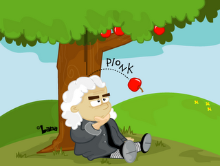
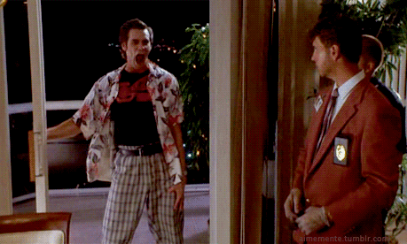
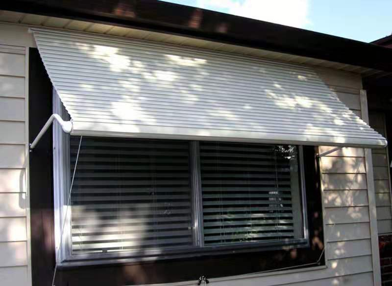
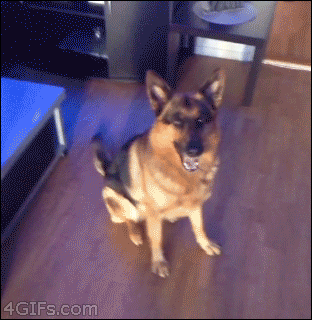
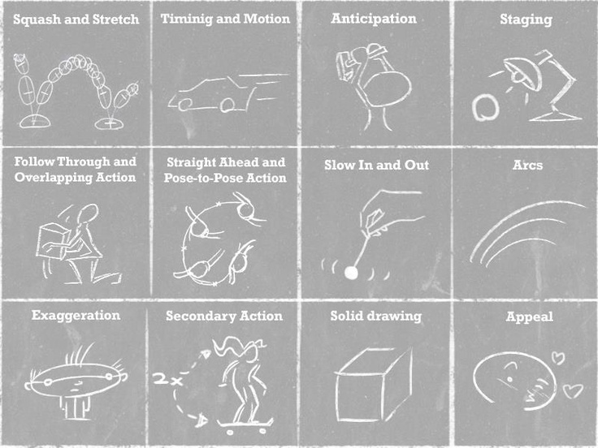

# Lean Animations

<small>赵锦江 talk.css#43 - 04/09/2019</small>

----

   Jinjiang
   zhaojinjiang
   zhaojinjiang@me.com

  <iframe height="100vh" style="width: 50vw; height: 100vh; max-height: none;" scrolling="no" src="//codepen.io/Jinjiang/embed/OYWJwX/" frameborder="no" allowtransparency="true" allowfullscreen="true"></iframe>
  <iframe height="100vh" style="width: 50vw; height: 100vh; max-height: none;" scrolling="no" src="//codepen.io/Jinjiang/embed/XQGmOR/" frameborder="no" allowtransparency="true" allowfullscreen="true"></iframe>

----

back to today's topic

# Lean Animations

----

<!-- backgroundImage: books.png -->
<!-- style: background-size: contain; -->

what does <mark>LEAN</mark> mean?

<!-- LEAN 是什么意思，这个词来自 LEAN 系列的图书，包括 LEAN enterprise、LEAN UX、LEAN Customer Development 等等，大致意思是简单并且明智，也意味着它便于理解、记忆和实践。 -->

----

what does <mark>ANIMATIONS</mark> mean?

<iframe style="width: 100vw; height: 100vh;" scrolling="no" title="Bouncing DVD Logo" src="//codepen.io/stezu/embed/cmLrI/?theme-id=0&default-tab=result" frameborder="no" allowtransparency="true" allowfullscreen="true"></iframe>

<note><a href='https://codepen.io/stezu/pen/cmLrI/'>Bouncing DVD Logo</a> by Stephen Zuniga</note>

<!-- ANIMATIONS 的意思就不必多解释了，它指的是页面上各种会动的效果。不过这里，我们把范围缩小到通过 CSS 实现的动画。 -->

----

### the GOAL

simply try animations into your product or design system

<!-- 这个主题主要的目的就是可以让大家*轻松的实践动画到你的产品或设计系统中*。之所以想到这个主题，是因为 talk.css 之前有过一个主题，讨论一个动画效果的实现原理，我在会后和作者的交流中发现，这样非常棒的效果我们其实很少有机会在产品中实践，主要是没有充足的时间，大家做这些动画都是利用业余时间一点一点做出来的。我觉得这还蛮可惜的，能不能找到一些合理的方式，让这些动画出现在真正的产品中，是我们今天想讨论的话题，也是希望可以达到的目的。 -->

<!-- The main purpose of this topic is to make it easy for everyone to practice animations into your product or design system. The reason why I think of this topic is because there was a topic in talk.css before, talking about the implementation of some cool animation effects. After the topic I had a chat with the speaker and found that we hardly build such a kind of great animations in our product. Mainly because the time is always limited. Mostly we do some creative animations in our spare time, not work time. It's a little pity. So could we find some better ways to make these animations happen in our real products? So here comes this topic today. Through this topic, I hope it could be achieved much easier. -->

----

### #1 <mark>why</mark> we need animations?

- something important
- something has changed
- something would/could change
- ~~art~~, just "show my skills" 🤪

<!-- 为什么我们需要动画？通常我们需要在*以下几种情况下*使用动画加以描述：界面是出现重要的内容时、界面产生了变化时、界面即将或可能产生变化时。当然还有一种情况就是没有实际的产品需求，但是你希望向别人展示你的技术有多厉害，或者只是纯为了有趣。这种情况其实也是难免出现的，不过我的建议还是三思而后行。 -->

<!-- Why do we need animation? Usually in the following situations: simply saying, when there are something really important, something already changed, or something about would, could or should change. Also of course, there is another situation not matching any purpose meaningful, but just from pure interests of yourself, or just you want to show everybody how skillful you are. Honestly, it is inevitable, sometimes. But I highly recommend you don't do that, or at least think twice before you wanna do. -->

----

### #2 common <mark>scenarios</mark>

- show/hide
- micro feedback
- emphasize
- logic or regularity

<!-- 同样的，基于上述的几种目的，我们发现有*四种场景*经常通过动画来进行表述。第一种是最常见的显示和隐藏，通常用于不同界面或状态的切换。第二种是微型反馈，比如点击按钮的时候的按钮轻微的下沉和弹起，让用户更好的感知到正在发生的事情。前两者你可能已经在使用了也比较熟悉了，那么接下来还有两种动画，第三种是强调，即捕获用户的视觉注意力，告诉用户这里的信息是非常重要的，值得留意的。第四种是描述界面的某种规律，让用户能够理解界面中的一些逻辑关系。 -->

<!-- Similarly, based on the several purposes above, there are four common scenarios of animations we often met. The first one is showing and hiding things. Just change or switch the states of UI like components, dialogs and pages. The second is micro-feedback, such as a slight popping of the button when you click on it. That give the users feedback about what is happening. These two scenarios you may already be familiar with, and there are another two more scenarios. One is emphasize, which means catch the user's visual attention. It tells the user the information here is worth paying attention to. And the last one is to let users understand some logics, relationships or regularities in your UI. We would talk about the details later. -->

----

next...

### #3 find all these kinds of scenarios in your product

<small>and <mark>choose</mark> animations for each of them</small>

<!-- 有了需求，也找到了常见的场景，接下来就是选择合适的动画效果的时候了。我们可以在你的产品中，以页面为单位，列出每个需要动画的地方，然后为其逐个选择适合的动画效果。 -->

<!-- With the purposes and common scenarios, next step we could list each places we need animations in your product, and then choose the appropriate animation effects one by one. -->

----

That seems simple but ...

----

<!-- backgroundImage: horse.jpg -->
<!-- style: background-size: contain; -->

<note>http://oktop.tumblr.com/post/15352780846</note>

<!-- 选择合适的动画效果听上去似乎很容易，但也许很多人并不知道如何下手。所以我接下来会提供一些个人建议。 -->

<!-- Choosing the right animation sounds easy, but maybe some people don't know where to start. So here are some advices for you. -->

----

### how to choose?

1.) get inspiration from the reality

<note>https://whitenoise.kinja.com/otters-oddities-1610623564</note>

<!-- 第一条建议，就是从现实生活中获取灵感。用户虽然对你的产品可能会感到陌生，但是每个人都有真实世界的生活经历，尝试为你的产品加入一些日常生活会遇到的特效，会帮助你的用户更容易的理解动效背后的含义。 -->

<!-- The first suggestion is to get inspiration from the real world. Maybe your users are unfamiliar with your products, but everyone has a real-world life experience. So you could just try to create some animation effects to connect our real daily life. It will help users to better understand the meanings behind them. -->

----

### reality example

<iframe style="width: 80vw; height: 60vh;" src="//player.vimeo.com/video/131559925?color=1ab89d&amp;title=0&amp;byline=0&amp;portrait=0" title="IBM 729 magnetic tape unit" frameborder="0" webkitallowfullscreen mozallowfullscreen allowfullscreen></iframe>

<note><a href="https://www.ibm.com/design/v1/language/experience/animation/elements/">IBM 729 magnetic tape unit</a></note>

<!-- 也许你已经见过很多日常生活中的效果应用到界面动画中的例子，这里我只想举一个特别的有趣的例子，是加载中的等待动效。这种动效一般用来交代你的界面内容正在准备中，随时可能会展示出来。这个磁带机的转动特效会暗示用户，虽然界面上还没有发生任何变化，但是你的应用正在紧张的工作之中，请耐心等待它的完成就好。 -->

<!-- Perhaps you have ever seen many examples of daily-life effects applied to UI animations. Here I just want to give a particularly interesting example of the loading spinner. This kind of animation is generally used to explain that your app is preparing something however it haven't beed done. The rotating animation effect is just implying users something working under the hook, please be patient and wait for it. -->

----

<!-- backgroundImage: muzli.png -->

or from internet

<note>[muzli search](https://search.muz.li)</note>

<!-- 除了真实世界之外，我们还可以通过互联网获得更多好做好的创意和灵感。这里只推荐一个地方，就是 muzli，你可以在这里搜索到各式各样的动效设计，作为你的参考。有的时候来这里看一看也是个不错的选择。 -->

<!-- In addition to the real world, we can also get more great ideas and inspirations through the Internet. Here just recommend one website: muzli search. You can search and discover tons of animation designs here. -->

----

<!-- backgroundImage: greenbook.jpg -->

### how to choose?

2.) to fit the characteristics  
  of your product

<note>https://www.heraldnet.com/life/spike-lee-wasnt-the-only-one-horrified-by-green-book-win/</note>

<!-- 第二条建议，就是选择适合你的产品风格的动效。 -->

<!-- And the rule number two is to choose the animation effects that fit the style of your product. -->

----

<!-- backgroundImage: greenbook.jpg -->

- soft or hard?
- fast or slow?
- more or less?

<!-- 试着问自己一些和产品有关的问题，你的产品如果是一个人的话，它的性格是怎样的？认真严肃的还是快乐轻松的？年轻有活力的还是成熟稳重的？简单务实的还是复杂华丽的？这些都成为了你选择动效的重要参考。某种意义上讲，这条规则比上一条更重要，因为它体现会你的产品的独一无二之处，也会避免你额外加入不合时宜的动效。也只有这样，整个产品至少从动效的角度看，会更有系统性，更像同一个产品。也更加容易快速实践。 -->

<!-- Try asking yourself some questions about the product. If your product is a person, what is its character? Serious or happy? Energetic or mature? Simple or complex? That's really important reference for your choice. It reflects the uniqueness of your product, and it also avoid you from adding wrong style animations. Only in this way, the entire product will be more systematic, at least from the perspective of animation effects. And it is also easier to practice quickly. -->

----

### so what i have chosen?

----

show/hide - <mark>slide</mark>

----

show/hide - <mark>fade in/out</mark>

----

show/hide - <mark>rollup</mark>

----

emphasize/feedback - <mark>popup</mark>

----

logic/regularity - <mark>bounce</mark> (what?!)

----

# <mark>Demo</mark>

<!--

接下来向大家展示一些例子：
1. 第一个例子是页面间切换的过渡动画，大家会发现，当我想访问的新页面的路径更深的时候，就会从右侧滑出，同理，如果新页面的路径深度更浅，则会从左侧滑出。这个简单而且固定的动效会让用户了解到当前页面路径的大概位置。
2. 第二个例子里有很多按钮，这里想展示的内容其实都会在每个按钮点击之后出现。首先，悬停或点击每个按钮的时候，按钮本身都会变色并放大一点点，看上去像瞬间跳起来一点点的样子，像是你们家的宠物在朝你身上乱蹦乱跳寻求关注一样，为用户操作提供及时的反馈。然后，弹出一个对话框的时候，整个屏幕会蒙上一层浅灰色，它告诉用户界面上的内容暂时不可操作了，好像现实世界中被东西盖住一样碰不到了。同时对话框在正中间被弹出，同样像跳起来一样，让用户的焦点来到这里，告诉用户这里才是他们需要操作的地方。同理，当我打开一个下拉列表的时候，这个列表会从上方翻转下来，像是可以从上方打开或关上的窗户一样。
3. 第三个例子是列表展示，当我们打开这个页面的时候，你首先会看到一个非常复杂的动画，这些列表项逐个向上靠拢，并稳定在最终的位置。每个列表项在靠近最终位置的时候都有一个小小的回弹的效果，就像东西撞到墙上或掉在地上的感觉。它所传递的信息有这么几个：第一，列表的阅读顺序是自上而下，因为最先展示的列表项是最上面的；第二，列表的上方已经没有更多内容了，因为所有的列表项都向上运动并回弹；第三，列表的下方可能还有更多内容，因为你并没有看到这个列表的尽头。所以在很短的时间内，我们通过动画向用户传递了如此丰富的信息，这就是动画的作用和魅力。
4. 再接下来我们看一个和列表类似的例子，那就是标签栏。这里有两个标签栏，不同的是，第一个标签栏的内容可以完全放入现有宽度的屏幕中，所以它们均分了整个屏幕的宽度；而第二个标签栏的内容比较多，整个屏幕的宽度已经无法容纳所有的标签，这个时候我们需要让标签栏可以横向滚动，并且产生一个类似列表展示的动画，告诉用户，这个标签栏的阅读顺序是从左到右，左侧没有更多的内容，右侧可能会有更多内容。

那么这些例子是如何实现的呢，我们来快速看一下源代码。虽然我们刚才展示了很多例子，但是实际上我们并没有针对每一个动效撰写 CSS，而是把这些动效进行了抽象和总结，并提前写在了一个叫做 base.css 的文件里。事实上这里的动效都是可复用的。整个项目是基于 Vue.js 撰写的，因为我自己对 Vue 更熟悉一些，但我相信 CSS 部分的代码，只要你对 CSS 足够熟悉，就可以看得懂。同时基于其它前端框架实现类似的动效，道理也是接近的。

-->

----

### #4 how to <mark>implement</mark>

- math/physics formulas
- simulating by keyframes

<!-- 从实现动效的思路来看，主要的方式有两种。第一种是通过物理公式或数学公式来描述和实现动画，它需要你找到动效背后的物理逻辑或数学逻辑。比如抛物线或滑动阻尼等。另外一种方式则是不断调整表面的动效参数，使其效果尽可能模拟和逼近某个真实的动效效果。至于具体如何通过 CSS 实现，我们已经假设大家对基本的 CSS animation 和 transition 很熟，所以就不多展开介绍了，但我接下来会演示一个具体的例子给大家。 -->

<!-- Here it comes to implementation. There are two common ways. One is through the physical or math formulas, which require you to find the logic behind the animations, such as gravity or frictions etc. In this way you may focus more on duration and timing-function of your CSS transitions. Another way is to directly record the keyframes to simulate a real world animation effect. We assume that everyone here is familiar with the knowledge of CSS animation and transition, so just skip the technical details. -->

----

# <mark>Code</mark>

----

### takeaways

- when: important, has/would/could
- what: emphasize, feedback, show/hide, regularity
- how: reality, characteristics
- way: formula, keyframes

<!-- 最后快速总结一下：为重要的、发生变化的和即将可能发生变化的东西制作动效；用于强调内容、显示隐藏内容、反馈交互行为及展示逻辑规律；然后从现实世界、互联网或产品特征的角度获取灵感；通过公式或效果拟合的方式加以实现。 -->

----

### further reading

<note>[The Twelve Principles of Animation from Disney](https://kryptonians.net/2017/01/05/the-twelve-principle-of-animation/)</note>

<!-- 最后如果这些效果都能够很好的实践，让我们更进一步，看看还有哪些更复杂的动效值得关注和实践，那就是迪士尼总结出来的 12 个最基本的动画原则。它会更复杂更难掌握，但是可以帮助我们作出更酷炫的动效。 -->

<!-- Finally, if these animation effects are well practiced, let's take it a step further to see more complex animation effects to practice. That is the 12 principles of animations from Disney. It's harder, but can help us make more beautiful animations effects. -->

----

# 终于讲完了😱

<mark>Thanks</mark>

