### 迎接 UI 設計工具的新時代

赵锦江 ModernWeb 2019

<!-- 現如今我們前端工程師越來越多討論技術和實現，但越來越少討論設計。設計工具是前端工程師長期以來一直在被動接受的一樣東西。隨著行業的發展，隨著設計本身的發展，也隨著 UI 技術的發展，設計工具是否已經發生，或者會在將來發生變化？它又會如何影響我們的工作？我們能在這其中主動做些什麼？希望可以藉此機會跟大家一起探討。 -->

----

<!-- backgroundImage: design2fe.png -->

身为前端工程师，很重要的职责之一，就是把设计师的想法变成现实。

----

<!-- backgroundImage: teamwork.jpg -->

所以我们每天都和设计师打很多交道。

----

<!-- backgroundImage: tools.jpg -->

而随着技术的发展和行业的发展，  
设计工具起到了越来越关键的作用。

----

### 最老牌的设计工具

  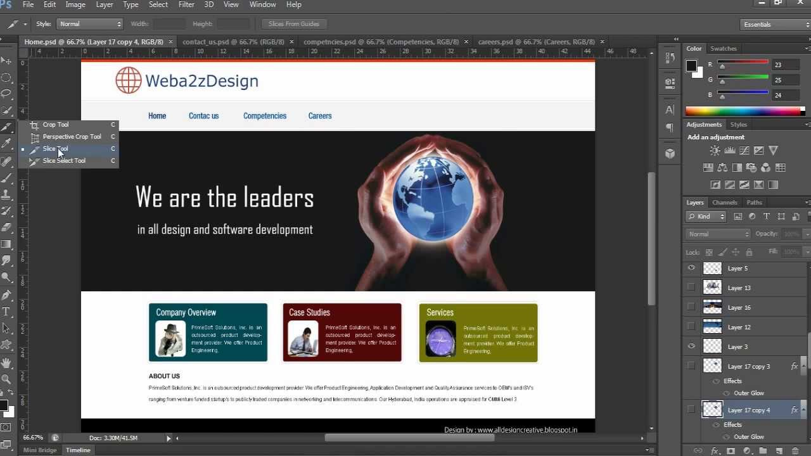
  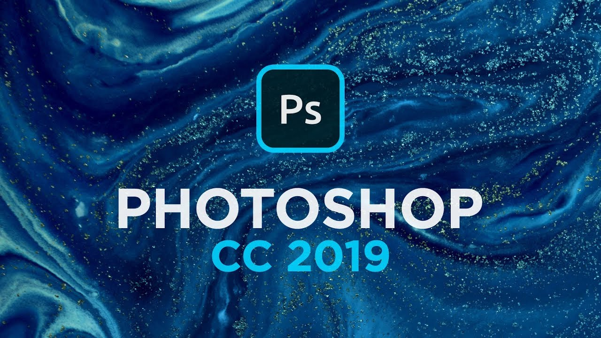

----

### 后起之秀 

  
  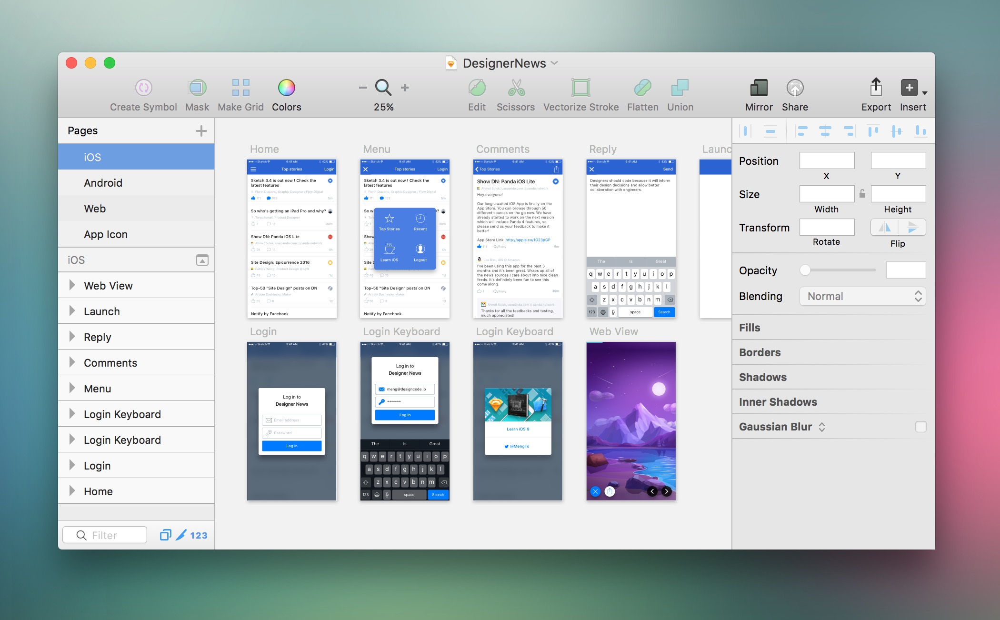

----

###  更精准的产品定位

- 更轻量，界面更简化
- 对矢量设计更友善
- 导出可用素材更方便
- 更友善的扩展插件平台

<note>educba.com - Photoshop vs Sketch | Top 7 Useful Difference To Know</note>

----

<!-- backgroundImage: tools.jpg -->

除此之外，还有哪些设计工作会主流地借助工具来完成？

----

<!-- backgroundImage: tools.jpg -->

- 头脑风暴、知识管理、素材收集……  
  (前端工程师不可见)
- 线框图设计、视觉设计、原型设计  
  (前端工程师可见)

----

- 笔 ✏️ + 纸 📄 (或各式手绘应用)
- Sketch  / PhotoShop 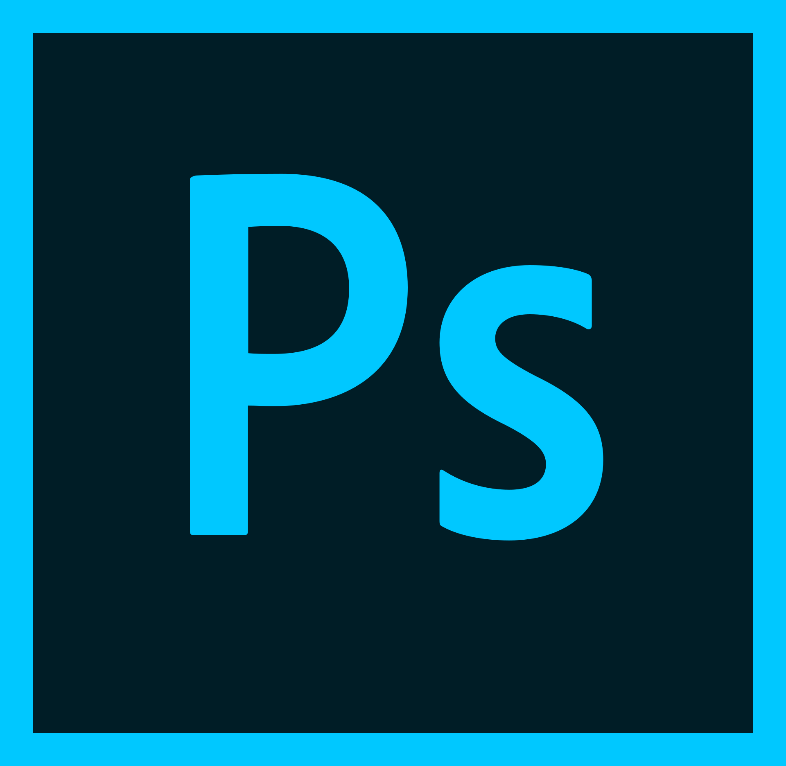
- Axure 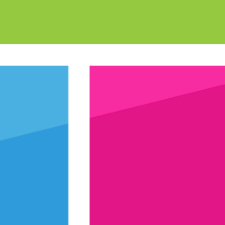
- GoogleDrive  / 

----

<!-- icons, graph -->

### 前端工程师的日常

- 交互评审：看  演示
- 视觉评审：看  /  演示
- 技术实现：下载、丈量、切割、导出
- 设计还原评审？测试？

----

这种状态持续了很长一段时间……

----

最近大家可能陆续发现了  
更多新的设计工具

    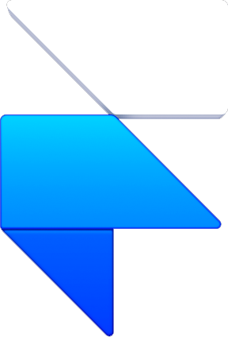  

----

究竟发生了什么？

设计工具存在问题吗？有哪些问题？

----

<!-- backgroundImage: markup.png -->

### 1. 丈量的问题

----

### 看一些例子……

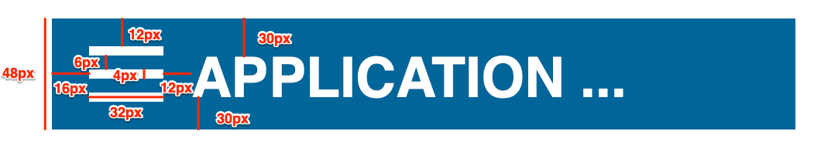

----

### 实际上……

----

### 只通过截图还原 Bootstrap

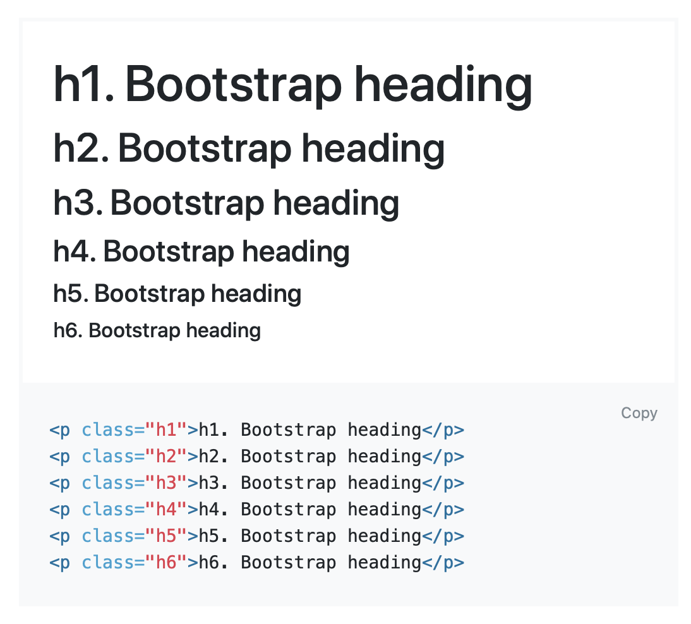

----

### 问题整理

- 可能存在多种理解
- 设计规律没有直观体现

----

### 其它更多问题

- 刚好差一像素不对称的设计
- 半透明颜色值
- ...

----

<!-- backgroundImage: markup.png -->

### 2. 布局的问题

----

### 绝对定位，标注需要重新换算

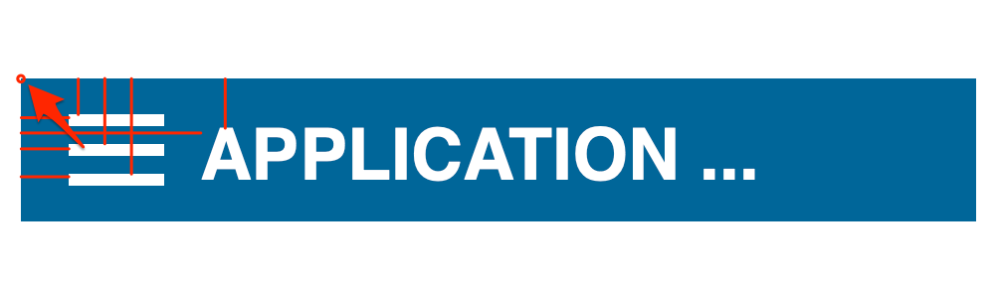

----

### 绝对定位，标注需要重新换算

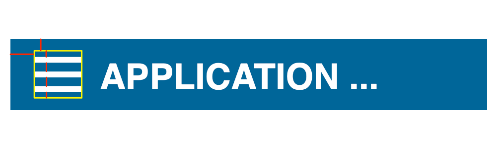

----

也引申出了布局层次和样式继承的问题

也引申出了对动态内容的控制力问题

----

### “不会自动撑开”

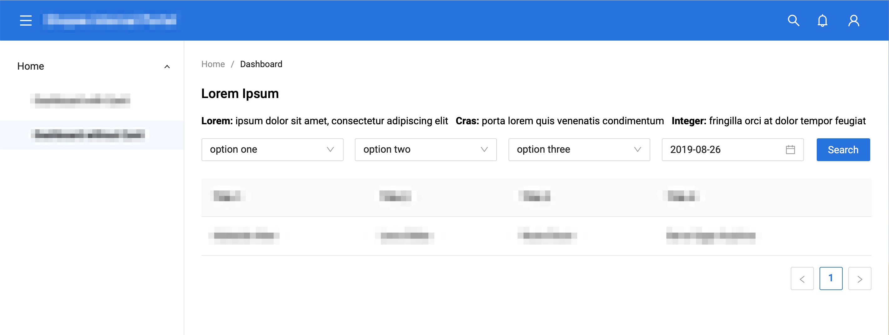

----

### 3. 响应性问题

<small>(responsive/flexible design)</small>

----

- 屏幕宽度(默认)是可变的  
  但设计工具的画布宽度是固定的
- 屏幕高度(默认)是可滚动的  
  但设计工具的画布高度是固定的

----

### 更特殊的例子：“开机画面”

  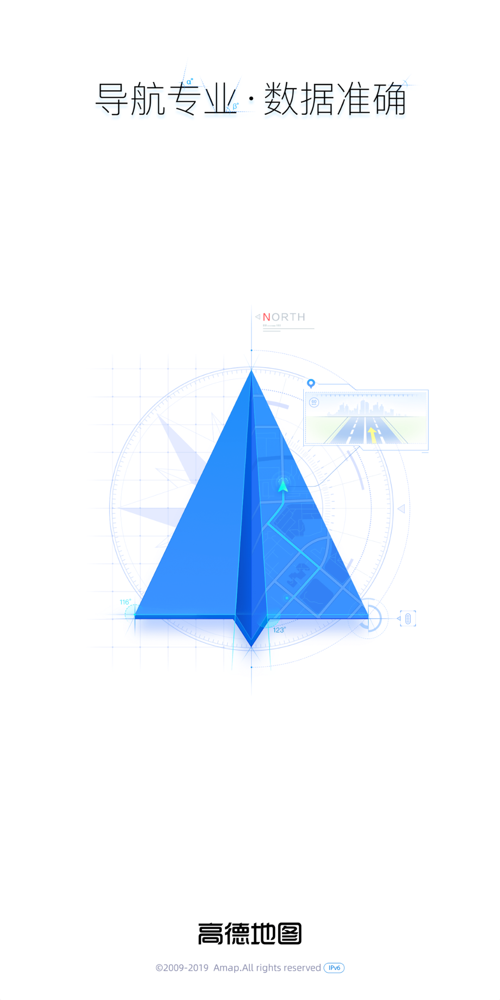
  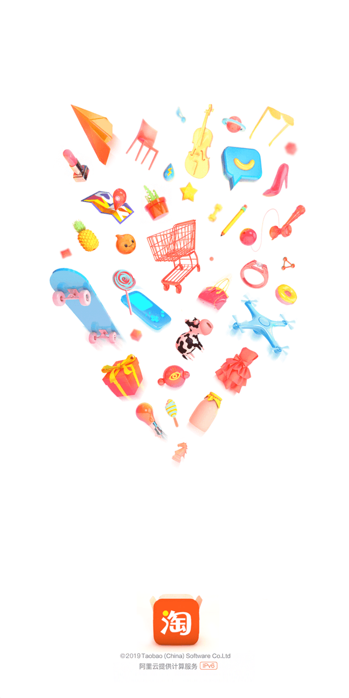
  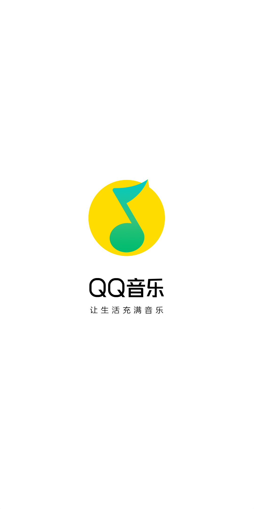

----

### 更多细节

- 多语言问题
- 用户浏览器偏好问题
- 缩放控制问题
- 平台设计差异问题……

----

### 4. 质量保障

----

“……X 项目做到快上线的时候，老板发现一个控件的设计细节的不合理，然后大家从组件级别开始返工……”

----

- 代码的质量可以通过  
  lint + review + test 来保障
- 设计稿的质量如何保障？  
  (包括技术可行性的因素)

----

<!-- backgroundImage: design-drafts.png -->

### 5. “中看不中用”的设计

- 设计师履历中的作品都很精美
- 但实际最终交付的是另外一回事

----

<!-- backgroundImage: design-drafts.png -->

“那都是技术人员的问题”

“白瞎了这么漂亮的设计”

----

<!-- backgroundImage: app-layout.png -->

### 6. 从设计到开发，重复脑力思考

----

<!-- backgroundImage: app-layout-markup.png -->

- 前端工程师实际需要从设计的角度重新理解和分解设计师的意图
- 但其实设计师已经思考过一次了
- 可惜的是这些思考并无法完整的通过设计稿体现和传递

<note>Guardian Design System</note>

----

<!-- backgroundImage: app-layout-markup.png -->

有的时候双份的思考和理解成本也无形中增加了项目的成本和复杂度

<note>Guardian Design System</note>

----

<!-- backgroundImage: contract.jpg -->

### 7. 缺乏对交付的规范定义

- 技术交付：API
- 设计如何定义交付？

----

<!-- backgroundImage: contract.jpg -->

- 如何交付动画？
- 可以再多举个例子吗？
- 设计做到怎样的程度算完成？
- 设计师什么时候可以抽身？
- 前端工程师经过反复沟通才会踏实

----

<!-- backgroundImage: idea.jpg -->

### 8. 单向的协作方式

- 工程师被动接受设计师交付的设计
- 那么设计师如何确定技术可行性？
- 或又如何保障创意设计的实现？

----

<!-- backgroundImage: should-designers-code.png -->

### Should Designer Code?

----

<!-- backgroundImage: should-designers-code.png -->

### 好的设计需要足够的专业参考

- 但建筑设计师应该去施工吗？
- 不懂建筑可以做好建筑设计吗？

可以不去做，但需要能理解

----

<!-- backgroundImage: traffic.jpg -->

### 9. 远离互联网产品的主流趋势

- 浏览器 + 云服务
- 自由分享和交流
- 借力繁荣开放的生态系统

----

<!-- backgroundImage: bg-tools.png -->

### 10. 和主流工程化系统隔离

- Github vs. GoogleDrive/Dropbox
- 版本控制和分支管理
- npm、各式各样的前端工具

----

### 其它更多话题

动画设计问题  
原型设计问题  
??? AR/VR 产品怎么设计 😱 ???

<small>……还都处在更原始的阶段</small>

<!--
- 主流设计工具都是静态画布
- 动画还处于“纯手工打造”的阶段
- 设计周期长，需要反复尝试，没有行业统一的工具和规范
- 交付成本高，没有适合的交付方式，重度依赖面对面沟通
- 局部更新
- 模态框
-->

----

以上……

丈量、布局、响应性、质量保障、还原度低、重复劳动、交付不严谨、单向协作、远离主流趋势、远离工程化系统

----

### 总结原因

1. 没有真实的运行环境
1. 缺乏足够健壮的工程环境和生态
1. 协作平台和流程有很大改进空间
1. 远离 Browser + Cloud 的主流模式
1. 缺乏对多层次系统性设计的支持

----

<!-- backgroundImage: gap.jpg -->

### 更深层的原因

前端从 UED 团队脱离之后，设计和前端在各自发展的同时渐行渐远，进而形成脱节的现象

<!-- <note>蒋定宇</note> -->

----

现在回头来看新出现的这些设计工具

基本都是在尝试解决上述问题

----

<!-- backgroundImage: tools-online.png -->

### 1. Browser + Cloud

----

### 2. 权限控制、分享、评注

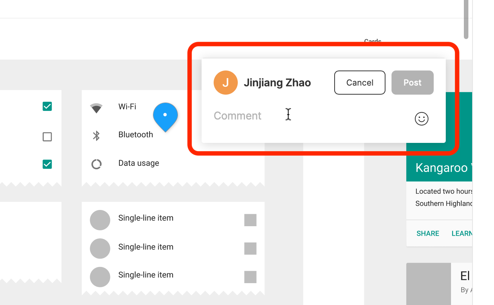

----

<!-- backgroundImage: tools-delivery.png -->
<!-- style: background-size: contain; background-color: #999; -->

### 3. 便于交付和演示

----

###  真实运行环境 + 代码组件

<video style="max-width: 80vw; max-height: 60vh;" src="tools-code.mp4" autoplay loop></video>

----

但我觉得这些还不够

<small>因为问题没有完全解决</small>

----

<!-- backgroundImage: browser.png -->

### 1. 尚未充分利用浏览器

<small>真实环境和静态设计习惯并存  
关键是鼓励设计师拥抱真实环境</small>

----

<!-- backgroundImage: ecosystem.jpg -->

### 2. 尚未充分利用技术生态

仍有大量的工具和生态可以赋能

----

<!-- backgroundImage: workflow.jpg -->

### 3. 尚未改变协作流程

工作流程包括协作方式仍有改进的空间

----

<!-- backgroundImage: system.jpg -->

### 4. 尚未体现更明确的系统性

<small>可以对 Design System 更友好</small>

----

## 畅想未来

----

<!-- backgroundImage: browser.png -->

### 1. Web-based ✅

----

<!-- backgroundImage: cloud.jpg -->

### 2. 云端存储和协作 ✅

分享、审阅、版本控制、文档

----

<!-- backgroundImage: design-system.png -->

### 3. Design System 越来越重要

- 和 Web Components 一脉相承
- 比目前的 Atomic Design 更进一步
- 根据 OS 多样性而差异化

----

<!-- backgroundImage: article-atomic-design.png -->

### Atomic Design

<note>Brad Frost, Atomic Design</note>

----

<!-- backgroundImage: article-atomic-design-1.png -->

<note>Brad Frost, Atomic Design</note>

----

<!-- backgroundImage: article-atomic-design-2.png -->

<note>Brad Frost, Atomic Design</note>

----

<!-- backgroundImage: more-details.jpg -->

让我们来尝试完善更多细节

----

<!-- style: background: white; -->

### “Atomic Design +”

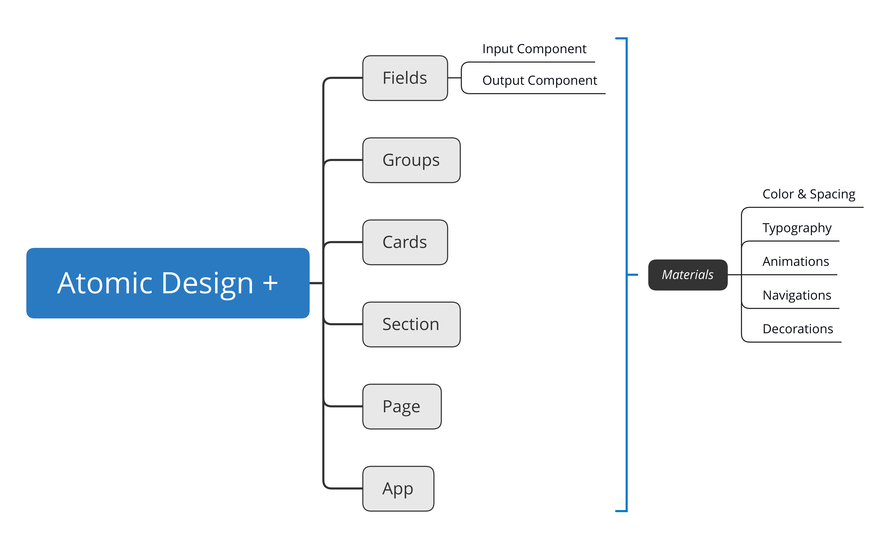

----

<!-- backgroundImage: layers.jpg -->

### 4. 设计工具会分层次

----

<!-- backgroundImage: layers.jpg -->

> As products and services grow in complexity, it is increasingly difficult for one company—no matter how large—to specialize simultaneously in all domains that go into producing it.
> 
> <small>— Tiwana, Amrit. Platform Ecosystems</small>

----

<!-- backgroundImage: layers.jpg -->

- 用于更多不同层次的工作  
  日常工作轻量化
- 如同  ➡️ 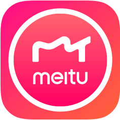
- __工程师会更多的参与工具研发__

----

<!-- backgroundImage: mix.jpg -->

### 5. 设计与技术相互输入

- 新的文化 (也许)
- 新的能力要求 (也许)
- 更细致的协作流程 (也许)
- 新的团队结构 (也许)

----

### 6. 前端工程师的工作相应变化

1. “把 instance 变为 class”
1. 将数据绑定带到“BFF”
1. 点缀于各级设计工具中的代码
1. 和设计师碰撞想法，储备素材和工具

----

### 7. 更多研发工具

- 属于设计的测试框架
- 属于设计的部署和发布平台

----

<!-- tailwind.css -->

### 8. 更大胆的猜想

- 新的前端框架？
- 新的语言？
- 新的 IDE？

----

这几乎是今天分享的全部内容...

----

A Keynote without  
AR / VR / AI / Blockchain?

----

# Thanks

We still on the way!

<note>all photos from pexels.com and unsplash.com</note>

<!--

拱门
一半蓝图一半实物
绝对定位标注
开机画面 -> iPhone 4

-->

<!--

[{"0":"transform","1":"width","2":"z-index","3":"filter","filter":"blur(0.05vw) grayscale(20%) contrast(50%)","transform":"translate(0vw, 10vh) rotate(-30deg) scale(3)","width":"50vw","zIndex":"1"},{"0":"top","1":"transform","2":"width","3":"z-index","4":"filter","filter":"blur(0.05vw) grayscale(20%) contrast(50%)","top":"50vw","transform":"translate(-10vw, 20vh) rotate(20deg) scale(3)","width":"50vw","zIndex":"2"},{"0":"left","1":"transform","2":"width","3":"z-index","4":"filter","filter":"blur(0.05vw) grayscale(20%) contrast(50%)","left":"50vw","transform":"translate(80vw, 0vh) rotate(15deg) scale(3)","width":"50vw","zIndex":"3"},{"0":"left","1":"top","2":"transform","3":"width","4":"filter","filter":"blur(0.05vw) grayscale(20%) contrast(50%)","left":"50vw","top":"50vw","transform":"translate(50vw, 15vh) rotate(-10deg) scale(3)","width":"50vw"}]

-->

<!--

[{"0":"transform","1":"width","2":"z-index","3":"filter","transform":"translate(20vw, 20vh) rotate(5deg) scale(1)","width":"50vw","zIndex":"5"},{"0":"transform","1":"width","2":"z-index","3":"z-index","4":"filter","transform":"translate(60vw, 40vh) rotate(-20deg) scale(1)","width":"50vw","zIndex":"2"},{"0":"transform","1":"width","2":"z-index","3":"z-index","4":"filter","transform":"translate(70vw, -5vh) rotate(-5deg) scale(1)","width":"50vw","zIndex":"4"},{"0":"transform","1":"width","2":"z-index","3":"width","4":"filter","transform":"translate(-5vw, 55vh) rotate(10deg) scale(1)","width":"50vw","zIndex":"7"},{"0":"transform","1":"width","2":"z-index","transform":"translate(30vw, 65vh) rotate(-5deg) scale(1)","width":"50vw","zIndex":"8"},{"0":"transform","1":"width","2":"z-index","transform":"translate(-4vw, 8vh) rotate(-51deg) scale(1.5)","width":"50vw","zIndex":"3"},{"0":"transform","1":"width","2":"z-index","transform":"translate(26vw, -21vh) rotate(10deg) scale(1)","width":"50vw","zIndex":"3"}]

-->

