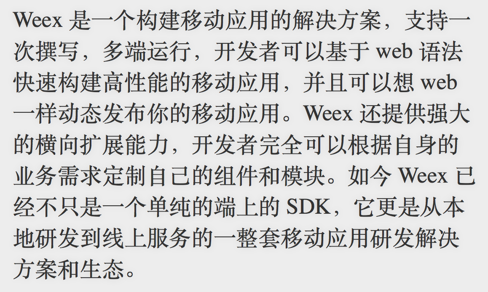
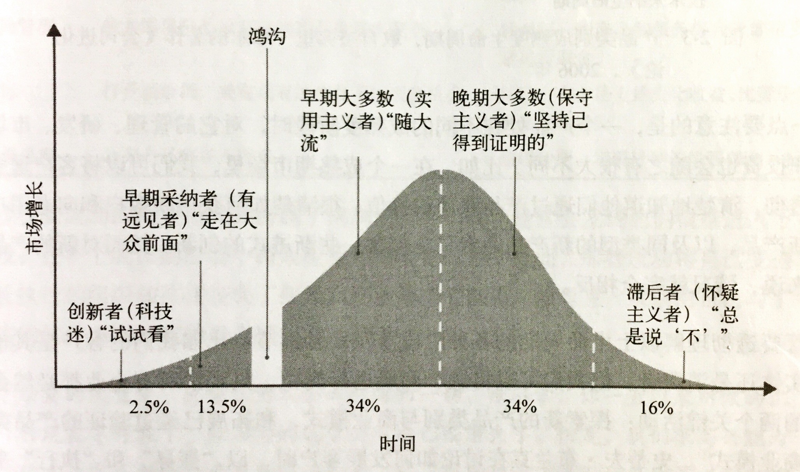
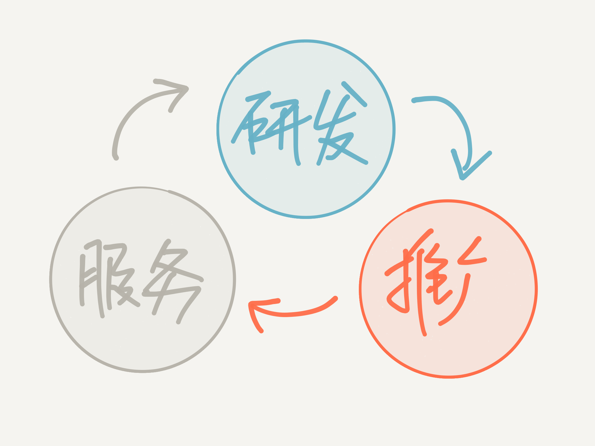

# 由 Weex 谈品牌经营心得

勾股 2017-03

----

做开源项目的本质是经营技术，更是经营一个品牌。我们希望透过 Weex 的发展经历，阐述从品牌的视角思考一个项目如何谋求发展和探索。

----

# 为什么品牌很重要

----

占领“用户心智”

----

* 饮料 = 可乐？
* HTML5 = Chrome？
* JavaScript = Facebook？
* 买东西 = 上天猫/淘宝？

----

我周围一个朋友这样说道：

> 大众的汽车没有给人什么特殊的印象，但是它给人的感觉是“这就是汽车”

----

### 三次“生产力革命”

1. 工业社会 -> 体力 -> 管理学
2. 知识社会 -> 脑力 -> 领导学
3. 差异化社会 -> 品牌

----

# 1. 拥有一个明确的定位

----

> (品牌) 定位也是第一个应对过度传播的社会中信息不被接受这一难题的思想体系
> ----《定位——有史以来对美国营销影响最大的观念》

----

1. 是什么？
1. 不是什么？

----

* 重量级 ❌
* 全能型 ❌
* “品牌延伸” ❌

----

* 找一个小的切入点 ✔
* 把问(tong)题(dian)完美解决 ✔

----

### Weex 在初期的定位

* 轻量级
* 高性能
* 可扩展

----

### Why？

* React Native -> 量级过重
* Hybrid -> 性能和体验不够好
* Native -> 不灵活，不可扩展

----

除此之外，Weex 还进一步缩小了范围，如电商领域、侧重内容展示等

----

# 2. 名称、Logo、口号

----

### 准备好迎接开发者的心态

* 产品要对用户友好
* 开源项目要对开发者友好

很多技术方案在发展初期  
并不重视这个视角

----

## 起个好听的名字

* 最简单：缩写型 (HTML)
* 更好一点：象征 (人物、动物)
* 再好一点：全新的名字

----

### 独一无二

善用搜索

----

### 好念好记

尽量简短，1\~2 个音节，  
有爆破音，好读

----

### 额外的，考虑各地文化

----

[http://www.wikihow.com/Name-a-Project](http://www.wikihow.com/Name-a-Project)

----

----

## Logo

----

看似简单的工作，实际也是有学问的。不是所有好看的 Logo 都适合。

----

头脑风暴，列出所有让你联想到的事物，然后基于这些发散的思路产生灵感，收敛范围，同时结合项目的气质。

----

在 Weex 的头脑风暴过后，设计师 @曳影 发现所有的词汇都能够直接或间接的和“老鹰”这个动物。

----

同时 @曳影 觉得 Weex 的团队非常有活力，不像一般的程序员那么死板，不苟言笑。

----

所以设计了一个活泼可爱的老鹰的形象。也就是今天的 Weex Logo。

----

## Slogan

----

### 电梯时间

选择和取舍

----

### 选择和取舍

“如果让你用一句话介绍你的产品，你会用哪句话？”

----

### 选择和取舍

“如果为你的产品选一个最大的亮点，你会选什么？”

----

可以先列出 5\~10 个方面，然后仔细排出他们的顺序

----

* 构建应用 (用途)
* 基于 web 开发体验 (开发体验)
* 可扩展性 (高阶开发)
* 高性能 (开发成本)
* 一次撰写多次运行 (开发成本)
* 服务和生态 (周边)
* 轻量 (开发体验)

----

1. 构建应用 (用途)
1. 一次撰写多次运行 (开发成本)
1. 高性能 (开发成本)
1. 轻量 (开发体验)
1. 基于 web 开发体验 (开发体验)
1. 可扩展性 (高阶开发)
1. 服务和生态 (周边)

----

### 把前面几个总结起来

* 一句话：1\~3 个
* 简述：3\~5 个
* 详述：5\~10 个

变成标准答案，用在不同的场合

----

### Slogan

构建跨平台移动应用

----

### 简述

Weex 是一个构建移动应用的解决方案，一次撰写多端运行，开发者可以基于 web 语法快速构建高性能的移动应用。

----

### 详述

<!-- todo:  -->

----

# 3. 传播的技巧

----

谁在讨论你的产品也是品牌塑造的一部分。

----

虽然开源社区是完全自由的，大家都是自愿参与，但是你自身的社区引导对社区成分起了决定性作用。

----

* 一线程序员
* 你的 Boss
* 同学朋友
* 家里的亲戚长辈
* ……

----

你希望谁在讨论你的项目？

选择相应的传播方式和渠道

----

### 用户发展演进图

----

以发展你的“种子用户”为首要目标，也是终极目标！

----

### 客户：移动互联网企业

* 在 Alibaba 谈 Weex (企业)
* 在 QCon 谈 Weex (企业)
* 在 滴滴、饿了么、小米、美大 谈 Weex

----

### 技术：优秀的程序员

* 在 JSConf/CSSConf 谈 Weex (意见领袖)
* 在 Vue 社区谈 Weex (意见领袖)
* 在 WeexConf 谈 Weex (意见领袖)

----

## 额外的：在传播过程中收集反馈

----

----

# 4. 打造团队

----

## 团队是打造品牌的执行者

社区文化 <- 项目文化 <- 团队文化

----

## 尽量保持团队小巧而专注

----

### “两个披萨”法则

团队应该小到两个披萨就够所有人吃，通常大概 5\~10 人。

----

### “两个披萨”的道理

1. 容易保持清晰一致的理解
1. 限制系统演进的速度，促进 1
1. 权力去中心化
1. 安全失败，培养领导力  
从而留住“创业型人才”

----

Weex 目前有多个团队在并行工作，每个团队人都不多且有各自明确的分工并独立决策。

----

## 关注员工超过一切

----

### 工作满意度

是被证实的非常重要的团队指标

[盖洛普 Q12 评测法](http://baike.baidu.com/subview/2529752/2529752.htm)

----

一个拥有关怀员工文化的团队，才会有同理心懂得如何关怀开源社区的开发者们。

----

一旦做到这点，美好的事情会在团队中自然发生。

----

### 丰田生产体系

对每个人能力的信任和价值的认可

----

### 著名的“安灯拉绳”

“任何人都有权利停下生产线”，换来的是一个濒临破产的美国汽车工厂在短短 3 个月内就可以交付高质量的产品。

----

## 关注技术质量

----

开源社区的东西都是免费的，大家只会选择最好的那一个。

----

* 注重 Code Review
* 注重测试

----

## 关注前瞻技术

----

* 让失败变得安全
* 降低尝试新技术的成本
* “实验型”工作方法

----

# 总结

----

1. 拥有一个明确的定位
2. 名称、Logo、口号
3. 传播的技巧
4. 打造团队

----

## 参考书目

----

----

----

----

----

----

# Thanks
