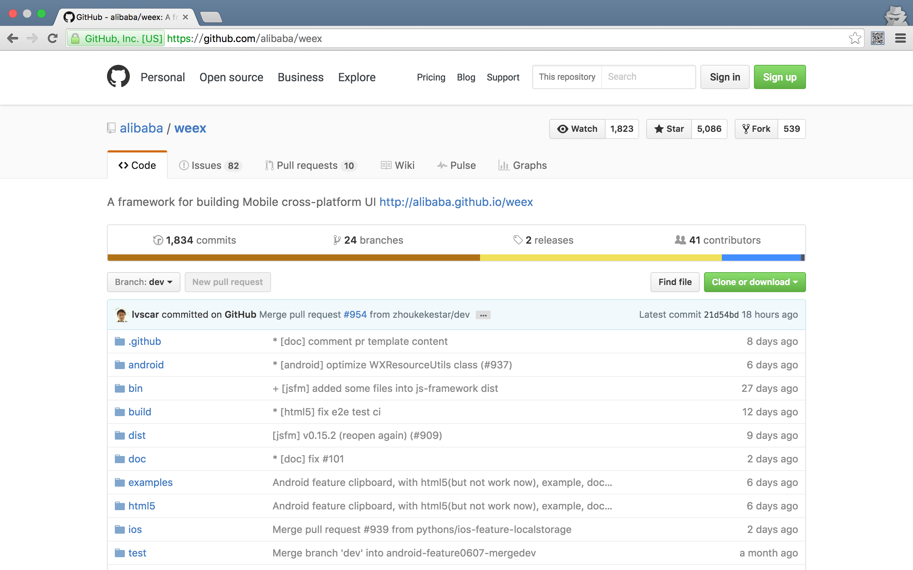
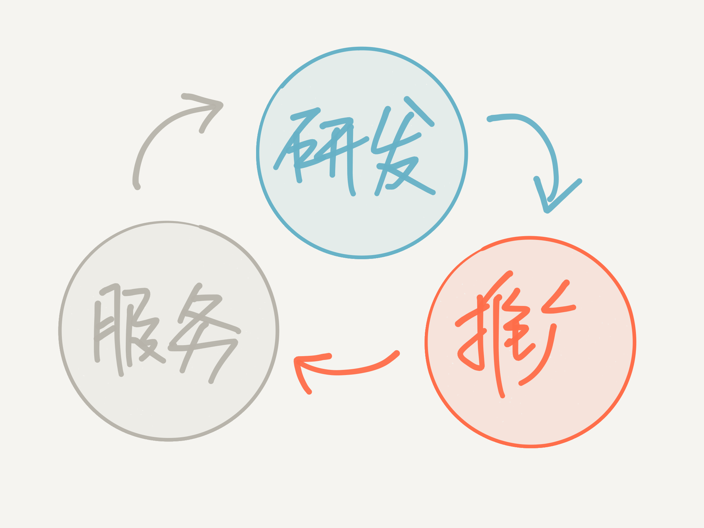
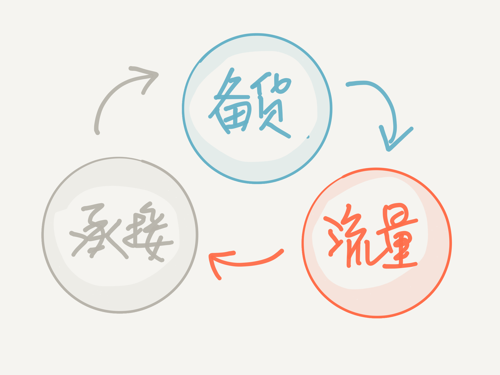

# Weex 开源之路

OSC源创会  
[@勾三股四](http://weibo.com/mx006)  

----

## 自我介绍

* 微博 [@勾三股四](http://weibo.com/mx006)
* github：[Jinjiang](http://github.com/Jinjiang/)
* 淘宝·杭州
* 业余爱好：足球、音乐

----

## 话题介绍

介绍Weex从诞生到开源的心路历程  
希望给在场的同学一些帮助和启发  
( 夹带一些技术和硬广 `O(∩_∩)O~` )

----

正 (zhuang) 文 (x)

----

<!-- backgroundImage: ./download_bg.jpg -->

广 (tui) 告 (guang)

----

<!--
  style: background: linear-gradient(to top right, rgba(0, 127, 221, 0.2), rgba(0, 127, 221, 0.2)), url(./weex-github.png) no-repeat center center / cover; color: #333;
-->

广告

## Weex 一句话概括

----

<!-- backgroundImage: ./download_bg.jpg -->

广告

*多端一致* 的 **高性能**  
移动 **动态** 化方案

----

<!--
  style: background: linear-gradient(to top right, rgba(0, 127, 221, 0.8), rgba(0, 127, 221, 0.8)), url(./cases.png) no-repeat center center / cover; font-weight: bold;
-->

广告

### 用人话说，就是……

* 基于HTML/CSS/JS构建移动应用
* 充分利用客户端的特性
* 以及 HTML5 的灵活性

----

<!--
  style: background: rgba(246, 245, 241, 1) url(./weex-arch.png) no-repeat center center / contain;
  color: #333;
-->

广告

&nbsp;

----

<!-- backgroundImage: ./download_bg.jpg -->

广告

### 6月底在 github 开源

----

<!--
  style: background: linear-gradient(to top right, rgba(192, 64, 0, 0.8), rgba(192, 64, 0, 0.8)), url(./1111.jpg) no-repeat center center / contain; font-weight: bold;
-->
广告

### 诞生过程

2015-06：双十一主会场命题  

* 体验 native 化
* 内容扁平化
* 数据个性化

----

<!-- backgroundImage: ./download_bg.jpg -->

广告

### 集各方思路之大成

* 现成的 `JSON->NativeView` 方案
* JavaScriptCore/V8
* Vue.js + web components

----

<!-- backgroundImage: ./download_bg.jpg -->

广告

### 为什么叫 Weex？

`[wi:ks]`

----

<!-- backgroundImage: ./download_bg.jpg -->

广告

> You gave us a few weeks, and we bring to you a few **Weex**.

----

## 1. 开源的念头

----

<!--
  backgroundImage: ./bora-bora-french-polynesia-sunset-ocean-large.jpg
-->

### 双11过后

* 意识到潜在的共性需求
* 希望发挥更大的作用
* 一起加速并推动技术发展

----

### 所以决定开源

> 继续搞大，唱响全球！  
> —— 我老板的老板 @南天

----

* 更多人推动
* 更充分的讨论
* 更多人收益

----

<!-- backgroundImage: ./pexels-photo-54300-large.jpeg -->

### 思考：开源的意义

* 找到志同道合的人
* 有共赢的目标

*和所有人 (甚至竞争对手) 一起共赢*

----

## 2. 如何开源

----

> (内部敏感信息扫码，)代码放 github  
> that's it！！！

----

我们把这样的开源看成  
*结果* 还是 *过程*？

----

### 当结果？

价值约等为 0

----

**思考：只是一个开始，要相信持续投入，就会持续产生价值**

----

### 当过程？

* 万里长征的开始
* 让它的价值不断被放大

----

## 3. 过程怎么做？

----

<!-- backgroundImage: ./hattricks.jpg -->

### 帽子戏法

----

<!-- backgroundImage: ./hattricks.jpg -->

----

<!-- backgroundImage: ./hattricks.jpg -->

### 这感觉就像开淘宝店……

----

<!-- backgroundImage: ./hattricks.jpg -->

----

<!-- backgroundImage: ./hattricks.jpg -->

### 思考

哪个环节都不能失衡  
不然会感受到很多痛苦  
有条不紊的“滚雪球”

----

### 但是这还不是很“开源”！

----

### 如何面对海量开发者的需求？

----

如何生长成一个

### “热闹”的开源项目？

----

## 4. 建立社区，建立生态

----

### 如何让所有人都参与进来？

----

### 技术上准备好横向可扩展

----

<!-- backgroundImage: ./service.jpg -->

### 全心全意为开发者服务

----
<!-- backgroundImage: ./download_bg.jpg -->
广告
团队早期只有 github issues，然后每天 notification center 被狂轰乱炸……
----
<!-- backgroundImage: ./download_bg.jpg -->
广告
逐渐的及时的讨论转移到了各种热心开发者创建的 QQ 群、微信群，并专门安排人值班……
----
<!-- backgroundImage: ./download_bg.jpg -->
广告
结果发现很多问题是重复的，产生大量重复的服务工作
----
<!-- backgroundImage: ./download_bg.jpg -->
广告
群人数都是有上限的
----
<!-- backgroundImage: ./download_bg.jpg -->
广告
贴代码不方便，不够“geek”
----
<!-- backgroundImage: ./download_bg.jpg -->
广告
后来发现 gitter 在很多方面都更加合适，于是我们创建了官方的 gitter 聊天室
----
<!-- backgroundImage: ./download_bg.jpg -->
广告
有归档方便查阅，可以和 github 更紧密的配合
----
<!-- backgroundImage: ./download_bg.jpg -->
广告
白天漏掉的消息，晚些时候还可以收到未阅读的聊天记录
----

<!--
  style: background: linear-gradient(to top right, rgba(0, 127, 221, 0.5), rgba(0, 127, 221, 0.5)), url(./comm1.png) no-repeat center center / cover; color: #333;
-->

广告

### 社区·协作

* 对外：issues 分工、gitter 答疑
* 内部：velocity 分工、钉钉群 答疑

----

<!--
  style: background: linear-gradient(to top right, rgba(0, 127, 221, 0.5), rgba(0, 127, 221, 0.5)), url(./comm2.png) no-repeat center center / cover; color: #333;
-->

广告

### 社区·协作

* 开发者自建的 QQ 群、论坛
* 我们的 articles repo
* 业务小组自己的讨论和建设等

----

### 被问到的最多的问题

----

### 怎么跑起来？

> 所有的软件都有个共性，就是按照官方文档运行不起来

心得：写好文档不是件简单的事情

----

### 为什么不支持X的Y功能？

心得：尽量明确你的侧重点、原则和 Roadmap

----

<!--
  style: background: linear-gradient(to top right, rgba(0, 127, 221, 0.5), rgba(0, 127, 221, 0.5)), rgba(246, 245, 241, 1) url(./eco-ali.png) no-repeat center center / contain; color: #333;
-->

广告

### 生态·分工

阿里内部技术生态逐渐形成

----

<!-- backgroundImage: ./pexels-photo-30342.jpg -->

### 生态·分工

对外我们正在筹划的……

----

<!-- backgroundImage: ./download_bg.jpg -->

广告

### 基于 Weex 的特色

* 三端一致
* 尊重规范和标准

----

<!--
  style: background: linear-gradient(to top right, rgba(0, 127, 221, 0.5), rgba(0, 127, 221, 0.5)), url(./comm3.png) no-repeat center center / cover; color: #333;
-->

广告

### 开发者参与核心团队决策

### 共建分享社区，互惠互利

----

## 5. 如何做好服务？

----

### 本质：开发者体验！

----

我们根据开发者的参与度  
划分了几个维度

----

1. 瞥一眼
1. 试试看
1. 用起来
1. 交流互动
1. 贡献

----

背后的需求和服务方式是不一样的

----

<!--
  style: background: linear-gradient(to top right, rgba(0, 127, 221, 0.5), rgba(0, 127, 221, 0.5)), url(./weex-website.png) no-repeat center center / cover;
-->

广告

### 瞥一眼

* Landing Page
* Features
* BIG BUTTON！
* README

----

<!--
  style: background: linear-gradient(to top right, rgba(0, 127, 221, 0.5), rgba(0, 127, 221, 0.5)), url(./downloads.png) no-repeat center center / cover;
-->

广告

### 试试看

* Getting Started
* Playground App
* Code Samples
* CLI / toolkit

----

<!-- backgroundImage: ./construction-work-carpenter-tools-large.jpg -->

### 用起来

* **稳定的版本**
* 详实的文档
* 丰富的示例
* 工程必备工具集
* 常见问题整理

----

<!--
  style: background: linear-gradient(to top right, rgba(0, 127, 221, 0.2), rgba(0, 127, 221, 0.2)), url(./devtools.png) no-repeat center center / cover; color: #333;
-->

广告

### Weex DevTools

----

### 交流互动

* 事务管理
* 及时答疑
* **主动走访业务**
* 线下交流

----

### 贡献

* **充分相互尊重**
* 编码规范
* 提交、分支管理约定
* 版本管理约定
* Code Review

----

## 6. 经过上述努力

的一点点小成绩

----

<!-- backgroundImage: ./download_bg.jpg -->

广告

* Star: 5000+
* Issues: 400+
* Pull Request: 500+
* Articles: 50+

----

<!-- backgroundImage: ./download_bg.jpg -->

广告

### 通过开发者一起改进的

* Windows 环境问题
* ES6 语法支持问题
* localStorage Module
* *文档完善*
* ……

----

<!-- backgroundImage: ./light-sign-typography-lighting-large.jpg -->

### 感谢开发者们的热情付出！

----

## 7. 几个印象深刻的问题

----

<!-- backgroundImage: ./food-summer-party-dinner-large.jpg -->

### 1) 如何面对伸手党？

----

<!-- backgroundImage: ./guardian.png -->

> [90:9:1 – the odd ratio that technology keeps creating](https://www.theguardian.com/technology/2015/dec/12/ratio-technology-mozilla-firefox-os-90-9-1)  
> —— 英国卫报

----

1. 主动迎接挑战，“从内打破”
2. 把握住推广节奏
3. 保持积极心态

----

<!--
  style: background: url(./danmu.png) no-repeat center center / contain, url(./download_bg.jpg) no-repeat center center / cover;
-->

### 2) 中文还是英文？

----

<!-- backgroundImage: ./weibo-en.png -->

> 被老外批评了[泪]说我不应该用中文在他那里和别人讨论问题…他还说英文也不是他母语…[委屈]  
> —— @大城小胖 的 [微博](http://weibo.com/1657422865/AsLonbZ50)

----

* English by default
* 开源是没有国界的
* 使用英文是对全世界的尊重

----

<!--
  style: background: linear-gradient(to top right, rgba(0, 127, 221, 0.8), rgba(0, 127, 221, 0.8)), url(./vj.png) no-repeat center center / cover; color: #333;
-->

广告

> Alibaba is working on their own version of React Native! Using Vue-like instead of React & css-layout. Super excited  
> —— @Vjeux 的 [Twitter](https://twitter.com/Vjeux/status/744103367773913088)

----

### 中文开发者离我们更近

同样需要非常重视

----

<!-- backgroundImage: ./download_bg.jpg -->

广告

借源创汇的机会宣布

### 中文开发者服务计划启动

专人负责、不只是文档

----

<!-- backgroundImage: ./download_bg.jpg -->

广告

技术和社区相对成形之后  
也是一个相对好的时机  
避免大量的重复返工和调整

----

### 3) 什么时候出 1.0？

----

考虑到  
Chrome、Java、Node、React  
的版本号……

----

1.0 已经是一种行为艺术

----

<!-- backgroundImage: ./versioning.png -->

> [Progressive Versioning](http://allinthehead.com/retro/373/progressive-versioning)  
> —— 网站：All in the `<head>`

----

Semantic Versioning  
*也*已经是一种行为艺术

----

*版本管理的关键  
兼顾快速迭代和业务实践*

----

### 4) 这么多坑没填呢就开源了？

----

### 4) 这个问题的反面：把所有问题都解决了再开源吧？

----

那就永远不会有开源的那一天了……

或者默认别人都是“伸手党”了……

----

*开源的魅力在于共建和成就的过程*

----

<!-- backgroundImage: ./jusephi.png -->

> 最好的 solution 是讨论出来的  
> —— 蒋定宇 [WebRebuild 2010](http://www.slideshare.net/josephj/webrebuild)

----

当然实现的时候不要贪多，弄好一个再弄下一个，永远对质量敏感

### 共勉

----

### 5) 如何面对质疑？

----

<!-- backgroundImage: ./lyh.png -->

> [Love Your Haters](https://medium.com/desk-of-van-schneider/love-your-haters-505506f71161#.szmgucu70)  
> —— Medium.com

----

* 保持冷静、保持友善
* 放下包袱、深度反思
* 充分沟通、兼容并包
* 放下立场、放慢脚步

----

### 其它细节

* 找到你的用户/客户
* 设计上的取舍和平衡
* 性能优化经验
* 团队如何决策和协作等……

时间关系，期待和大家更多的交流

----

<!--
  style: background: linear-gradient(to top right, rgba(0, 127, 221, 0.2), rgba(0, 127, 221, 0.2)), url(./weex-github.png) no-repeat center center / cover; color: #333; font-weight: bold;
-->

广告

# Thanks

### [https://github.com/alibaba/weex](https://github.com/alibaba/weex)

